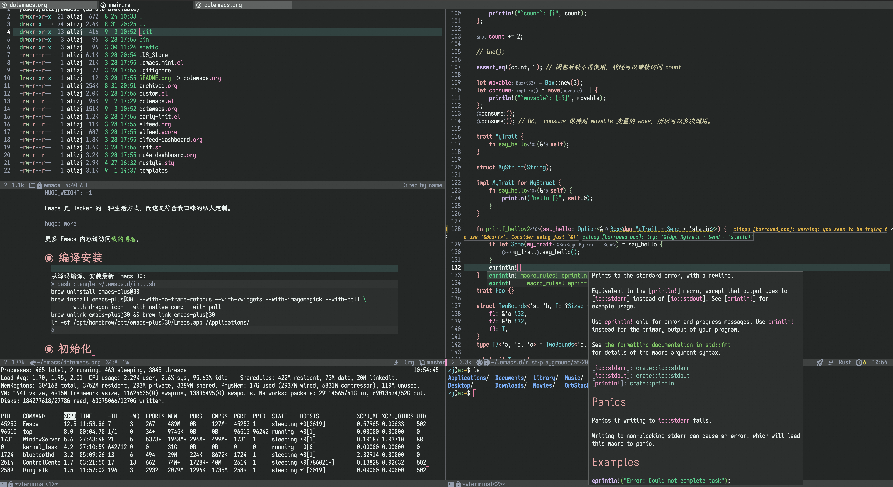

#+Title: My Emacs Dotfile
 #+DATE: 2023-08-20 Sun
 #+LASTMOD: 2026-09-07T12:39:44+0800
 #+AUTHOR: 张俊(geekard@qq.com)
 #+STARTUP: overview hideblocks
 #+PROPERTY: header-args:emacs-lisp :tangle yes :eval never :results silent :exports code
 #+HUGO_BASE_DIR: ~/blog/blog.opsnull.com
 #+HUGO_SECTION: emacs
 #+HUGO_BUNDLE: my-emacs-dotfile
 #+EXPORT_FILE_NAME: index
 #+HUGO_AUTO_SET_LASTMOD: t
 #+HUGO_TAGS: emacs
 #+HUGO_LOCALE: zh
 #+OPTIONS: title:t prop:t ^:nil
 #+HUGO_WEIGHT: -1

 Emacs 是 Hacker 的一种生活方式，而这是符合我口味的私人定制。

 #+hugo: more

 更多 Emacs 内容请访问[[https://blog.opsnull.com/emacs/][我的博客]]。

 #+ATTR_HTML: :width 400 :align center
 

* 编译安装
:PROPERTIES:
:ID:       D5199801-F9CB-41B7-9867-591FC9F992CE
:END:

从源码编译、安装最新 Emacs 31 版本:

#+begin_src bash :tangle ~/.emacs.d/init.sh
brew tap d12frosted/emacs-plus
brew uninstall emacs-plus@31
brew install emacs-plus@31 --HEAD --with-xwidgets --with-imagemagick
brew unlink emacs-plus@31 && brew link emacs-plus@31
ln -sf /opt/homebrew/opt/emacs-plus@31/Emacs.app /Applications/
#+end_src

* 初始化
:PROPERTIES:
:ID:       78A417CD-EE54-40C1-8C26-CA4E275EE082
:END:

安装 native 编译所需的 gcc 工具链：

#+begin_src bash :tangle ~/.emacs.d/init.sh
brew install gcc
current_gcc="/opt/homebrew/opt/gcc/lib/gcc/current"
export LIBRARY_PATH="${LIBRARY_PATH}:${current_gcc}"
#+end_src

=early-init.el= 是 Emacs 启动早期执行的第一个初始化文件：

#+begin_src emacs-lisp :tangle ~/.emacs.d/early-init.el
;;; -*- lexical-binding: t; -*-

;; 个人信息。
(setq user-full-name "zhangjun")
(setq user-mail-address "geekard@qq.com")

(set-language-environment "UTF-8")

(setq-default lexical-binding t)
(setq lexical-binding t)

;; 在独立文件保存 Emacs 自动写入的配置参数，避免污染 ~/.emacs 文件。
(setq custom-file (expand-file-name "~/.emacs.d/custom.el"))
(add-hook 'after-init-hook
  	  (lambda ()
  	    (when (file-exists-p custom-file)
  	      (load custom-file))))

;; 非系统标准路径的二进制目录列表（优先查找靠后目录）
(setq my-bin-path
      '("/opt/homebrew/bin"
        "/opt/homebrew/opt/findutils/libexec/gnubin"
        "/opt/homebrew/opt/openjdk/bin"
        "/Users/alizj/go/bin"
  	  ;; .cargo/bin 的优先级要高于 rustup/bin，这样优先使用编译安装的命令。
        "/opt/homebrew/opt/rustup/bin"
        "/Users/alizj/.cargo/bin"))

;; 添加到 PATH 环境变量。
(mapc (lambda (p)
  	(setenv "PATH" (concat p ":" (getenv "PATH"))))
      my-bin-path)

;; 添加到 Emacs 搜索路径：Emacs 查找外部程序时使用 `exec-path` 而非 `PATH` 变量。
(let ((paths my-bin-path))
  (dolist (path paths)
    (setq exec-path (cons path exec-path))))
#+end_src

设置软件包源：
+ =M-x use-package-report= : 查看包加载时间（按 S 排序）；
+ =M-x package-vc-upgrade-all= ：更新使用 ~:vc~ 指令配置的，从 ~github~ 安装的包；

#+begin_src emacs-lisp
;;; -*- lexical-binding: t; -*-

(require 'package)
(setq package-archives
      '(("elpa" . "https://mirrors.tuna.tsinghua.edu.cn/elpa/gnu/")
        ("elpa-devel" . "https://mirrors.tuna.tsinghua.edu.cn/elpa/gnu-devel/")
        ("melpa" . "https://mirrors.tuna.tsinghua.edu.cn/elpa/melpa/")
        ("nongnu" . "https://mirrors.tuna.tsinghua.edu.cn/elpa/nongnu/")
        ("nongnu-devel" . "https://mirrors.tuna.tsinghua.edu.cn/elpa/nongnu-devel/")))
(package-initialize)
;; 首次安装或更新包时手动执行 M-x package-refresh-contents，启动不刷新归档。

(setq use-package-verbose t)
(setq use-package-always-ensure t)
(setq use-package-always-demand t)
(setq use-package-compute-statistics t)
(setq use-package-vc-prefer-newest t)

;; 允许升级 Emacs 内置的包。
;;(setq package-install-upgrade-built-in t)
#+end_src

启用 native 编译和确保使用编译后的字节码文件，提升性能：

#+begin_src emacs-lisp
;; The following enables compilation of packages during installation; compile-angel will handle it.
(setq package-native-compile t)

(when (fboundp 'native-compile-async)
  (setenv "LIBRARY_PATH"
  	  (concat (getenv "LIBRARY_PATH")
  		  ":/opt/homebrew/opt/gcc/lib/gcc/current/"
  		  ;;":/opt/homebrew/opt/gcc/lib/gcc/current/gcc/aarch64-apple-darwin25/16/"
		  ))
  (setq native-comp-speed 2)
  (setq native-comp-async-jobs-number 3)
  ;;(setq inhibit-automatic-native-compilation t)
  (setq native-comp-async-report-warnings-errors 'silent))

;; 解决 cmake 和 Xcode 15.0 兼容性问题，否则后续编译 vterm-module 时报错。
;;; 查看当前 Xcode SDK 路径：xcrun --sdk macosx --show-sdk-path
(setenv "SDKROOT" "/Applications/Xcode.app/Contents/Developer/Platforms/MacOSX.platform/Developer/SDKs/MacOSX.sdk")

;; 确保 Emacs 加载较新 byte-compiled 的 .el 文件。
(setq-default load-prefer-newer t)
(setq load-prefer-newer t)

;; Ensure that quitting only occurs once Emacs finishes native compiling,
;; preventing incomplete or leftover compilation files in `/tmp`.
(setq native-comp-async-query-on-exit t)
(setq confirm-kill-processes t)

;; Speeds up Emacs by ensuring that all Elisp libraries are both byte-compiled and native-compiled
(use-package compile-angel
  :config
  ;; Set `compile-angel-verbose' to nil to disable compile-angel messages.
  ;; (When set to nil, compile-angel won't show which file is being compiled.)
  (setq compile-angel-verbose t)

  ;; The following directive prevents compile-angel from compiling your init
  ;; files. If you choose to remove this push to `compile-angel-excluded-path-suffixes'
  ;; and compile your pre/post-init files, ensure you understand the
  ;; implications and thoroughly test your code. For example, if you're using
  ;; the `use-package' macro, you'll need to explicitly add:
  ;; (eval-when-compile (require 'use-package))
  ;; at the top of your init file.
  (push "/init.el" compile-angel-excluded-path-suffixes)
  (push "/early-init.el" compile-angel-excluded-path-suffixes)

  ;; Uncomment the line below to compile automatically when an Elisp file is saved
  (add-hook 'emacs-lisp-mode-hook #'compile-angel-on-save-local-mode)

  ;; A global mode that compiles .el files when they are loaded using `load' or `require'.
  (compile-angel-on-load-mode 1))
#+end_src

提升 IO 性能，参考 [[https://github.com/doomemacs/core/blob/master/modules/doom/init.el][doom core]] 配置参数：

#+begin_src emacs-lisp
(setq process-adaptive-read-buffering nil)

;; The maximum amount of data Emacs reads from a subprocess in a single operation
;; 对于 GNU/Linux，设置的是 /proc/sys/fs/pipe-max-size 值。
;; 可以提升大项目的 eglot 性能（与 LSP 通过 JSON-RPC 交换数据时，一次可以读取更多数据）。
(setq read-process-output-max (* 1024 1024 1)) ;; default: 4kb

;; This reduces log clutter to improves performance.
(setq jsonrpc-event-hook nil)

;; Garbage Collector Magic Hack, 提升 GC 性能。
(use-package gcmh
  :init
  ;;(setq gcmh-verbose t)
  (setq gcmh-idle-delay 'auto) ;; 缺省 15s
  (setq gcmh-auto-idle-delay-factor 10)
  (setq gcmh-high-cons-threshold (* 64 1024 1024)) ;; 64mb
  (gcmh-mode 1)
  ;;(gcmh-set-high-threshold)
  )

;;(setq garbage-collection-messages t)
(add-hook 'after-init-hook #'garbage-collect t)
#+end_src

安全的自动关闭不活跃的 buffer，节省资源:

#+begin_src emacs-lisp
(use-package buffer-terminator
  :custom
  (buffer-terminator-verbose nil)

  ;; Set the inactivity timeout (in seconds) after which buffers are considered
  ;; inactive (default is 30 minutes):
  (buffer-terminator-inactivity-timeout (* 30 60)) ; 30 minutes

  ;; Define how frequently the cleanup process should run (default is every 10
  ;; minutes):
  (buffer-terminator-interval (* 10 60)) ; 10 minutes

  :init
  (buffer-terminator-mode 1))
#+end_src

其它性能优化：

#+begin_src emacs-lisp
;; A second, case-insensitive pass over `auto-mode-alist' is time wasted.
;; No second pass of case-insensitive search over auto-mode-alist.
(setq auto-mode-case-fold nil)  

;; Disable bidirectional text scanning for a modest performance boost.
(setq-default bidi-display-reordering 'left-to-right
              bidi-paragraph-direction 'left-to-right)

;; Give up some bidirectional functionality for slightly faster re-display.
(setq bidi-inhibit-bpa t)

;; 用内存换取字体 redisplay CPU；macOS、Nerd Fonts、图标较多时可以保留。
(setq inhibit-compacting-font-caches t)

(setq-default message-log-max 16384)

;; Resizing the Emacs frame can be costly when changing the font. Disable this
;; to improve startup times with fonts larger than the system default.
(setq frame-resize-pixelwise t)

;; Without this, Emacs will try to resize itself to a specific column size
(setq frame-inhibit-implied-resize t)

(setq whitespace-line-column nil)  ; Use the value of `fill-column'.

;; 关闭全局高亮当前行，性能优先。
;;(global-hl-line-mode t)
;;(setq global-hl-line-sticky-flag t)
(global-hl-line-mode -1)
(add-hook 'prog-mode-hook #'hl-line-mode)
;;(add-hook 'text-mode-hook #'hl-line-mode)

;; 关闭全局显示行号，性能优先。
;;(global-display-line-numbers-mode t)
;; 仅编程模式显示行号。
(add-hook 'prog-mode-hook #'display-line-numbers-mode)

;; 避免 undo-more: No further undo information 报错.
;; 10X bump of the undo limits to avoid issues with premature.
;; Emacs GC which truncages the undo history very aggresively
;; 不能设置太大，否则多个大 buffer 同时编辑时，可能显著抬高内存和 GC 压力。
(setq undo-limit (* 1 1024 1024)
      undo-strong-limit (* 16 1024 1024)
      undo-outer-limit (* 64 1024 1024))

(setq global-mark-ring-max 600)
(setq mark-ring-max 600)
(setq kill-ring-max 600)

;; 大文件按当前 buffer 的字符数判断，避免每次检查都访问磁盘或 TRAMP。
(defcustom my-large-file-threshold (* 1024 1024)
  "启用大文件性能配置的字符数阈值。"
  :type 'integer
  :group 'files)

(defvar-local my-large-file-saved-state nil
  "进入大文件配置前的局部设置，退出时恢复。")

(defun my-large-file-performance-setup ()
  "按字符数切换大文件配置；重复执行不会覆盖原始状态。"
  (let ((large (and buffer-file-name
                    (save-restriction
                      (widen)
                      (> (buffer-size) my-large-file-threshold))))
        (modes '(display-line-numbers-mode rainbow-delimiters-mode
                 hl-line-mode show-paren-local-mode)))
    (cond
     (large
      (unless my-large-file-saved-state
        (setq my-large-file-saved-state
              (list (list 'corfu-auto (local-variable-p 'corfu-auto)
                          (boundp 'corfu-auto)
                          (and (boundp 'corfu-auto) corfu-auto))
                    (mapcar (lambda (mode)
                              (cons mode (and (boundp mode) (symbol-value mode))))
                            modes))))
      (setq-local corfu-auto nil)
      (dolist (mode modes)
        (when (fboundp mode) (funcall mode -1))))
     (my-large-file-saved-state
      (let ((corfu-state (car my-large-file-saved-state))
            (mode-state (cadr my-large-file-saved-state)))
        (if (nth 1 corfu-state)
            (setq-local corfu-auto (nth 3 corfu-state))
          (kill-local-variable 'corfu-auto))
        (dolist (entry mode-state)
          (when (fboundp (car entry))
            (funcall (car entry) (if (cdr entry) 1 -1))))
        (setq my-large-file-saved-state nil))))))

(dolist (hook '(find-file-hook after-revert-hook after-save-hook))
  (add-hook hook #'my-large-file-performance-setup))

;; 开启全局自动 revert。
(global-auto-revert-mode 1)
(setq auto-revert-remote-files nil) 
(setq revert-without-query (list "\\.png$" "\\.svg$")
      auto-revert-verbose nil)
;; 自动 revert buffer（更新周期由 auto-revert-interval 配置），确保 modeline 上的分支名正确。
(setq auto-revert-check-vc-info t)
(setq auto-revert-interval 30) ;; 缺省：5s，对于大型项目如 zed 会引起卡顿。
#+end_src

设置 GPG 加解密：

#+begin_src emacs-lisp
(setq auth-sources '("~/.authinfo.gpg"))
;;(setq auth-source-debug t)

(use-package epa
  :ensure nil
  :config
  (setq-default
   ;; 缺省使用 email 地址加密。
   epa-file-encrypt-to user-mail-address
   ;; 使用 minibuffer 输入 GPG 密码。
   epa-pinentry-mode 'loopback)

  (require 'epa-file)
  (epa-file-enable))
#+end_src

按键调整：

#+begin_src emacs-lisp
;; command 作为 Meta 键。
(setq mac-command-modifier 'meta)

;; option 作为 Super 键。
(setq mac-option-modifier 'super)

;; fn 作为 Hyper 键。
(setq ns-function-modifier 'hyper)

;; 关闭容易误操作的按键。
;; s- 表示 Super，S- 表示 Shift, H- 表示 Hyper:
(let ((keys '(
              "s-w"
              "C-z"
              "<mouse-2>"
              "s-k"
              "s-,"
              "s-."
              "s--"
              "s-+"
              "C-<wheel-down>"
              "C-<wheel-up>"
              "C-M-<wheel-down>"
              "C-M-<wheel-up>"
              ;;"<down-mouse-1>"
              ;;"<drag-mouse-1>"
              )))
  (dolist (key keys)
    (global-unset-key (kbd key))))
#+end_src

* 代理
:PROPERTIES:
:ID:       63224D09-9EE7-4233-9374-6FA3C0C9C26F
:END:

~MacOS~ 自带的 ~curl~ 不支持 ~socks5~ 代理, 这里安装支持 ~socks5~ 的 ~GNU curl~ 版本:

#+begin_src bash :tangle ~/.emacs.d/init.sh
brew install curl
export PATH="/opt/homebrew/opt/curl/bin:$PATH"
#+end_src

将 ~GNU curl~ 添加到 ~Emacs~ 的 ~PATH~ 环境变量和 ~exec-path~ 变量中：

#+begin_src emacs-lisp
(setq my-coreutils-path "/opt/homebrew/opt/curl/bin/")
(setenv "PATH" (concat my-coreutils-path ":" (getenv "PATH")))
(setq exec-path (cons my-coreutils-path  exec-path))
#+end_src

~Emacs~ 使用 ~url-retrieve~ 访问 ~URL~ ，默认 ~HTTP~ 代理支持 ~socks5~ ，但是 ~HTTPS~ 代理不支持。这里设置它使用
~curl~ 后端，这样全局可使用 ~socks5~ 代理：

#+begin_src emacs-lisp
;; socks5 代理信息。
(setq my/socks-host "127.0.0.1")
(setq my/socks-port 1080)
(setq my/socks-proxy (format "socks5h://%s:%d" my/socks-host my/socks-port))

;; 传给外部程序的 NO_PROXY/no_proxy 列表。curl 支持 CIDR 和域名后缀。
(setq my/no-proxy-env
      '(
        "127.0.0.1/32"
        "10.0.0.0/8"
        "172.0.0.0/8"
        "0.0.0.0/32"
        "localhost"
        "192.168.0.0/16"
        ".cn"
        ".alibaba-inc.com"
        ".taobao.com"
        ".antfin-inc.com"
        ".openai.azure.com"
        ".baidu.com"
        ".aliyun-inc.com"
        ".aliyun-inc.test"
        ))

;; `socks-noproxy' 只接受主机名正则表达式，不识别 CIDR。
;; IP 段用前缀正则；域名正则同时匹配根域和子域，并锚定字符串结尾。
(setq my/socks-noproxy
      '("\\`127\\.0\\.0\\.1\\'"
        "\\`10\\."
        "\\`172\\."
        "\\`0\\.0\\.0\\.0\\'"
        "\\`localhost\\'"
        "\\`192\\.168\\."
        "\\.cn\\'"
        "\\(?:\\`\\|\\.\\)alibaba-inc\\.com\\'"
        "\\(?:\\`\\|\\.\\)taobao\\.com\\'"
        "\\(?:\\`\\|\\.\\)antfin-inc\\.com\\'"
        "\\(?:\\`\\|\\.\\)openai\\.azure\\.com\\'"
        "\\(?:\\`\\|\\.\\)baidu\\.com\\'"
        "\\(?:\\`\\|\\.\\)aliyun-inc\\.com\\'"
        "\\(?:\\`\\|\\.\\)aliyun-inc\\.test\\'"))

(setq my/user-agent
      "Mozilla/5.0 (Macintosh; Intel Mac OS X 10_15_7) AppleWebKit/537.36 (KHTML, like Gecko) Chrome/94.0.4606.71 Safari/537.36")

(use-package mb-url-http
  :vc (:url "https://github.com/dochang/mb-url")
  :init
  (require 'auth-source)
  (let ((credential (auth-source-user-and-password "api.github.com")))
    (setq github-user (car credential)
          github-password (cadr credential))
    (setq github-auth (concat github-user ":" github-password))
    (setq mb-url-http-backend 'mb-url-http-curl
          mb-url-http-curl-program "/opt/homebrew/opt/curl/bin/curl"
          mb-url-http-curl-switches
          `(
	    ;;关闭服务端证书校验。
	    "-k"
            "-x" ,my/socks-proxy
            "--keepalive-time" "60"
            "--keepalive"
            "--max-time" "300"
            ;;防止 POST 超过 1024 Bytes 时发送 `Expect: 100-continue` 导致 1s 延迟。
            "-H" "Expect:"
            ;;"-u" ,github-auth
            "--user-agent" ,my/user-agent
            ))))

;; 开启 socks5 代理。
(defun proxy-socks-enable ()
  (interactive)
  (require 'socks)
  (setq url-gateway-method 'socks
        socks-noproxy my/socks-noproxy
        socks-server `("Default server" ,my/socks-host ,my/socks-port 5))
  (let ((no-proxy (mapconcat #'identity my/no-proxy-env ",")))
    (setenv "no_proxy" no-proxy)
    (setenv "NO_PROXY" no-proxy))
  (setenv "all_proxy" my/socks-proxy)
  (setenv "ALL_PROXY" my/socks-proxy)
  (setenv "HTTP_PROXY" nil)
  (setenv "HTTPS_PROXY" nil)
  (advice-add 'url-http :around 'mb-url-http-around-advice))

;; 关闭 socks5 代理。
(defun proxy-socks-disable ()
  (interactive)
  (require 'socks)
  (setq url-gateway-method 'native socks-noproxy nil)
  (setenv "all_proxy" "")
  (setenv "ALL_PROXY" ""))

;; 默认启动时开启 socks5 代理。
(proxy-socks-enable)
#+end_src

* 界面
:PROPERTIES:
:ID:       7EE74847-BC77-4B83-A73E-78C9CBDB8446
:END:

关闭部分 UI 元素：

#+begin_src emacs-lisp
(when (memq window-system '(mac ns x))
  (tool-bar-mode -1)
  (scroll-bar-mode -1)
  (menu-bar-mode -1)
  ;; 不使用系统对话框，因为不同系统风格完全不一样。
  (setq use-file-dialog nil)
  (setq use-dialog-box nil))
#+end_src

光标和行号：

#+begin_src emacs-lisp
;; 设置光标样式。
(setq-default cursor-type 'bar)

;; 光标和字符宽度一致（如 TAB)。
(setq x-stretch-cursor t)
#+end_src

frame 设置：

#+begin_src emacs-lisp
;; frame 边角样式：undecorated, round corner: undecorated-round
(add-to-list 'default-frame-alist '(undecorated . t))
(add-to-list 'default-frame-alist '(ns-transparent-titlebar . t))
(add-to-list 'default-frame-alist '(selected-frame) 'name nil)
(add-to-list 'default-frame-alist '(ns-appearance . dark))
;; 新建 frame window 的大小。
(add-to-list 'default-frame-alist '(height . 24))
(add-to-list 'default-frame-alist '(width . 80))

;; 不在新 frame 打开文件（如 Finder 的 "Open with Emacs") 。
(setq ns-pop-up-frames nil)

;; 复用当前 frame。
(setq display-buffer-reuse-frames t)
(setq frame-resize-pixelwise t)

;; 30: 左右分屏, nil: 上下分屏。
(setq split-width-threshold nil)

;; 刷新显示。
(global-set-key (kbd "<f5>") #'redraw-display)

(setq switch-to-buffer-obey-display-actions t)

;; 帮助和工具 buffer 默认放在底部侧窗；传给 regexp-opt 的是未转义名称。
(add-to-list 'display-buffer-alist
             `(,(concat "\\`" (regexp-opt
                               '("*compilation*" "*Apropos*" "*Help*" "*helpful"
                                 "*info*" "*Summary*" "*vt" "*Org"
                                 "*Google Translate*" "*EGLOT" " *eglot" "*Shell Command Output*")))
               (display-buffer-reuse-window display-buffer-in-side-window)
               (side . bottom)
               (window-height . 0.35)))

;; 启动后显示模式，加 t 参数让 togg-frame-XX 最后运行，这样才生效：
(add-hook 'window-setup-hook 'toggle-frame-maximized t) ;; toggle-frame-fullscreen
#+end_src

窗口和滚动：

#+begin_src emacs-lisp
;; 切换窗口。
(global-set-key (kbd "s-o") #'other-window)

(setq window-combination-resize t)

;; 像素平滑滚动。
(pixel-scroll-precision-mode t)
(setq fast-but-imprecise-scrolling t)
(setq scroll-conservatively 10
      scroll-margin 2
      scroll-preserve-screen-position t
      mouse-wheel-scroll-amount '(2 ((shift) . hscroll))
      mouse-wheel-scroll-amount-horizontal 2)
#+end_src

dashboard：

#+begin_src emacs-lisp
(use-package dashboard
  :config
  (dashboard-setup-startup-hook)
  (setq-local global-hl-line-mode nil)
  (setq dashboard-banner-logo-title "Happy Hacking & Writing 🎯")
  (setq dashboard-projects-backend #'project-el)
  (setq dashboard-center-content t)
  (setq dashboard-set-heading-icons t)
  (setq dashboard-set-navigator t)
  (setq dashboard-set-file-icons t)
  (setq dashboard-path-max-length 30)
  ;; 显示 org-mode agenda。
  (add-to-list 'dashboard-items '(agenda) t)
  (setq dashboard-items '((recents . 20) (projects . 8) (agenda . 3))))
#+end_src

doom-modeline：

#+begin_src emacs-lisp
;; 使用 Symbols Nerd Fonts Mono 在 modeline 上显示 icons，需要单独下载和安装该字体。
(use-package nerd-icons)

(use-package doom-modeline  
  :demand t
  :hook (after-init . doom-modeline-mode)
  :custom
  (doom-modeline-buffer-encoding nil)
  (doom-modeline-env-version nil)
  (doom-modeline-env-enable-rust nil)
  (doom-modeline-env-enable-go nil)
  (doom-modeline-buffer-file-name-style 'truncate-nil)
  (doom-modeline-vcs-max-length 30)
  (doom-modeline-github nil)
  (doom-modeline-time-icon nil)
  (doom-modeline-check-simple-format t)
  :config
  (display-battery-mode 0)
  (column-number-mode t)
  (display-time-mode t)
  (setq display-time-24hr-format t)
  (setq display-time-default-load-average nil)
  (setq display-time-load-average-threshold 20)
  (setq display-time-format "%H:%M ") ;; 默认："%m/%d[%w]%H:%M "
  (setq indicate-buffer-boundaries (quote left)))

;; 为 vterm-mode 定义简化的 modeline，避免 vterm buffer 内容过多时更新 modeline 影响性能。
(doom-modeline-def-modeline 'my-vterm-modeline
  '(buffer-info) ;; 左侧
  '(misc-info minor-modes input-method)) ;; 右侧
(add-to-list 'doom-modeline-mode-alist '(vterm-mode . my-vterm-modeline))
#+end_src

dired-sidebar：使用 dired 显示目录，相比 treemacs/neotree 的优势是速度快和使用 dired 按键：

#+begin_src emacs-lisp
(use-package vscode-icon
  :ensure t
  :commands (vscode-icon-for-file))

(use-package dired-subtree
  :ensure t
  :commands (dired-subtree-toggle dired-subtree-cycle)
  :config
  (setq dired-subtree-line-prefix " ")
  (setq dired-subtree-use-backgrounds nil))

(use-package dired-sidebar
  :ensure t
  :bind (("C-M-0" . dired-sidebar-toggle-sidebar))
  :commands (dired-sidebar-toggle-sidebar)
  :init
  (add-hook 'dired-sidebar-mode-hook
            (lambda ()
	      (display-line-numbers-mode -1)
              (unless (file-remote-p default-directory)
                (auto-revert-mode))))
  :config
  (push 'toggle-window-split dired-sidebar-toggle-hidden-commands)
  (push 'rotate-windows dired-sidebar-toggle-hidden-commands)
  (setq dired-sidebar-subtree-line-prefix "__")
  (setq dired-sidebar-theme 'vscode) ;;'ascii
  (setq dired-sidebar-use-term-integration t)
  (setq dired-sidebar-use-one-instance t)
  (setq dired-sidebar-use-custom-font t)
  (setq dired-sidebar-icon-scale 0.1)
  ;;(setq dired-sidebar-window-fixed nil) ;; 可以手动调整宽度和高度。
  ;;(setq dired-sidebar-resize-on-open t)
  ;; 性能优先：关闭 follow-file 或者调大 idly-delay。
  (setq dired-sidebar-should-follow-file t)
  (setq dired-sidebar-follow-file-idle-delay 1.5))
#+end_src

字体：英文 Iosevka/Sarasa 和中文 LxgwWenKai，按照 1:1 缩放，在偶数字号的情况下可以实现中英文等宽等高。
+ 英文：[[https://github.com/protesilaos/iosevka-comfy][Iosevka Comfy]];
+ 中文：霞鹜文楷屏幕阅读版 [[https://github.com/lxgw/LxgwWenKai-Screen/releases][LxgwWenKai-Screen]]，对字体做了加粗，便于屏幕阅读;

常用字体命令:
+ 查看 Emacs 支持的字体名称： =M-: (print (font-family-list))=
+ 查看光标处字体： =M-x describe-char=
+ 查看 Emacs 支持的字体名称： =M-: (print (font-family-list))=

#+begin_src emacs-lisp
(use-package fontaine
  :config
  (setq fontaine-latest-state-file (locate-user-emacs-file "fontaine-latest-state.eld"))
  (setq fontaine-presets
	'((regular) ;; 使用缺省配置。
	  (t
	   :default-family "Iosevka Comfy"
	   :default-weight regular
	   :default-height 180 ;; 默认字号, 需要是偶数才能实现中英文等宽等高。
	   :fixed-pitch-family "Iosevka Comfy"
	   :fixed-pitch-weight nil
	   :fixed-pitch-height 1.0
	   :fixed-pitch-serif-family "Iosevka Comfy"
	   :fixed-pitch-serif-weight nil
	   :fixed-pitch-serif-height 1.0
	   :variable-pitch-family "Iosevka Comfy Duo"
	   :variable-pitch-weight nil
	   :variable-pitch-height 1.0
	   :line-spacing nil)))
  (fontaine-mode 1)
  (fontaine-set-preset (or (fontaine-restore-latest-preset) 'regular))
  (add-hook 'kill-emacs-hook #'fontaine-store-latest-preset))

;; 设置 emoji/symbol 和中文字体。
(defun my/set-font ()
  (when window-system
    (setq use-default-font-for-symbols nil)
    (set-fontset-font t 'emoji (font-spec :family "Apple Color Emoji")) ;; Noto Color Emoji
    (set-fontset-font t 'symbol (font-spec :family "Symbola")) ;; Apple Symbols, Symbola
    (let ((font (frame-parameter nil 'font))
	  (font-spec (font-spec :family "LXGW WenKai Mono Screen")))
      (dolist (charset '(kana han hangul cjk-misc bopomofo))
	(set-fontset-font font charset font-spec)))))

;; Emacs 启动后或 fontaine preset 切换时设置字体。
(add-hook 'after-init-hook 'my/set-font)
(add-hook 'fontaine-set-preset-hook 'my/set-font)

;; 设置字体缩放比例，设置为 1.172 可以确保 2 倍放大后对应的是 22 号偶数字体，这样表格
;; 可以对齐。16 * 1.172 * 1.172 = 21.97（Emacs 取整为 22）。
(setq text-scale-mode-step 1.172)

;; org-table 只使用中英文严格等宽的 LXGW WenKai Mono Screen 字体, 避免中英文不对齐。
(custom-theme-set-faces 'user '(org-table ((t (:family "LXGW WenKai Mono Screen")))))
#+end_src

ef-themes: Emacs 主题列表：https://emacsthemes.com/popular/index.html

#+begin_src emacs-lisp
(use-package ef-themes
  :demand
  :config
  (mapc #'disable-theme custom-enabled-themes)
  (setq ef-themes-variable-pitch-ui t)
  (setq ef-themes-mixed-fonts t)
  (setq ef-themes-headings
        '(
          ;; level 0 是文档 title，1-8 是文档 header。
          (0 . (variable-pitch light 1.9))
          (1 . (variable-pitch light 1.8))
          (2 . (variable-pitch regular 1.7))
          (3 . (variable-pitch regular 1.6))
          (4 . (variable-pitch regular 1.5))
          (5 . (variable-pitch 1.4))
          (6 . (variable-pitch 1.3))
          (7 . (variable-pitch 1.2))
          (8 . (variable-pitch 1.1))
          (t . (variable-pitch 1.1))))
  (setq ef-themes-region '(intense no-extend neutral)))
#+end_src

自动切换深浅主题:

#+begin_src emacs-lisp
(defun my/load-theme (appearance)
  (interactive)
  (pcase appearance
    ('light (load-theme 'ef-light t))
    ('dark (load-theme 'ef-elea-dark t))))
(add-hook 'ns-system-appearance-change-functions 'my/load-theme)
(add-hook 'after-init-hook (lambda () (my/load-theme ns-system-appearance)))
#+end_src

tab-bar：

#+begin_src emacs-lisp
(use-package tab-bar
  :custom
  (tab-bar-close-button-show nil)
  (tab-bar-new-button-show nil)
  (tab-bar-history-limit 20)
  (tab-bar-new-tab-choice "*dashboard*")
  (tab-bar-show 1)
  ;; 使用 super + N 切换 tab。
  (tab-bar-select-tab-modifiers '(super))
  :config
  ;; 去掉最左侧的 < 和 > 。
  (setq tab-bar-format '(tab-bar-format-tabs tab-bar-separator))
  
  ;; 开启 tar-bar history mode 后才支持 history-back/forward 命令。
  ;; tab-bar-history-mode 可以替换老的 winner mode（它不感知 tab 切换）。
  (tab-bar-history-mode t)
  (global-set-key (kbd "s-f") 'tab-bar-history-forward)
  (global-set-key (kbd "s-b") 'tab-bar-history-back)
  (global-set-key (kbd "s-t") 'tab-bar-new-tab)
  (keymap-global-set "s-n" 'tab-bar-switch-to-next-tab)
  (keymap-global-set "s-p" 'tab-bar-switch-to-prev-tab)
  (keymap-global-set "s-w" 'tab-bar-close-tab)

  ;; 为 tab 添加序号，用于快速切换。
  (defvar ct/circle-numbers-alist
    '((0 . "⓪")
      (1 . "①")
      (2 . "②")
      (3 . "③")
      (4 . "④")
      (5 . "⑤")
      (6 . "⑥")
      (7 . "⑦")
      (8 . "⑧")
      (9 . "⑨"))
    "Alist of integers to strings of circled unicode numbers.")
  (setq tab-bar-tab-hints t)
  (defun ct/tab-bar-tab-name-format-default (tab i)
    (let ((current-p (eq (car tab) 'current-tab))
          (tab-num (if (and tab-bar-tab-hints (< i 10))
                       (alist-get i ct/circle-numbers-alist) "")))
      (propertize
       (concat tab-num
               " "
               (alist-get 'name tab)
               (or (and tab-bar-close-button-show
                        (not (eq tab-bar-close-button-show
                                 (if current-p 'non-selected 'selected)))
                        tab-bar-close-button)
                   "")
               " ")
       'face (funcall tab-bar-tab-face-function tab))))
  (setq tab-bar-tab-name-format-function #'ct/tab-bar-tab-name-format-default)

  (global-set-key (kbd "s-1") 'tab-bar-select-tab)
  (global-set-key (kbd "s-2") 'tab-bar-select-tab)
  (global-set-key (kbd "s-3") 'tab-bar-select-tab)
  (global-set-key (kbd "s-4") 'tab-bar-select-tab)
  (global-set-key (kbd "s-5") 'tab-bar-select-tab)
  (global-set-key (kbd "s-6") 'tab-bar-select-tab)
  (global-set-key (kbd "s-7") 'tab-bar-select-tab)
  (global-set-key (kbd "s-8") 'tab-bar-select-tab)
  (global-set-key (kbd "s-9") 'tab-bar-select-tab))
#+end_src

* 输入法
:PROPERTIES:
:ID:       F2A2728F-20BA-4E48-89EF-6AFBCB8C327E
:END:

使用 ~RIME~ 输入法 + ~iDevel/rime-ice~ 雾凇拼音输入法方案。

安装 ~RIME~ 输入法后端引擎 [[https://github.com/rime/librime/releases][librime]] ： ~emacs-rime~ 直接和该引擎打交道，不需要安装前端程序
"鼠须管squirrel"。

#+begin_src bash :tangle ~/.emacs.d/init.sh
wget https://github.com/rime/librime/releases/download/1.17.0/rime-33e7814-macOS-universal.tar.bz2
tar -xvf rime-33e7814-macOS-universal.tar.bz2
mv ~/.emacs.d/librime/dist{,.bak}
mv dist ~/.emacs.d/librime
# 如果 MacOS Gatekeeper 阻止第三方软件运行，可以暂时关闭它：
sudo spctl --master-disable
# 后续再开启：sudo spctl --master-enable
#+end_src

下载 [[https://github.com/iDvel/rime-ice.git][iDvel/rime-ice]] 雾凇拼音输入法方案：

#+begin_src bash :tangle ~/.emacs.d/init.sh
mv ~/Library/Rime ~/Library/Rime.bak
git clone https://github.com/iDvel/rime-ice --depth=1
mv rime-ice ~/Library/Rime
# 后续可以 git pull 更新 rime-ice。
cd ~/Library/Rime
# 自定义词频文件
cp custom_phrase.txt  opsnull_custom_phrase.txt
# 修改其中的 db_name
sed -i -e 's/custom_phrase.txt/opsnull_custom_phrase/g' opsnull_custom_phrase.txt
#+end_src

rime_ice 如模糊音(拼音方案调整，动态词频，自定义词语文件等):
+ 自定义短语：向自定义短语词典文件 =opsnull_custom_phrase.txt= 添加自定义短语，
  custom_prase/db_class 为 stabledb，是只读的，不会动态调频。（可以设置为 tabledb 来
  动态调频）。
+ 首次添加该文件后需要执行 =M-x rime-deploy= 和 =M-x rime-sync= 生效。

#+begin_src yaml :tangle ~/Library/Rime/rime_ice.custom.yaml
patch:
  switches:
  - name: ascii_mode
    states: [ 中, Ａ ]
  - name: ascii_punct  # 中英标点
    states: [ ¥, $ ]
  # 下面这些开关一般用不到, 故关闭(如候选词中不再显示 emoji).
  # - name: traditionalization
  #   states: [ 简, 繁 ]
  #   reset: 0
  # - name: emoji
  #   states: [ 💀, 😄 ]
  #   reset: 1
  # - name: full_shape
  #   states: [ 半角, 全角 ]
  #   reset: 0
  # - name: search_single_char  # search.lua 的功能开关，辅码查词时是否单字优先
  #   abbrev: [词, 单]
  #   states: [正常, 单字]
  #   reset: 0

  translator/spelling_hints: 0           # 不显示候选词的拼音。
  translator/always_show_comments: false #不显示候选者的拼音。
  translator/enable_user_dict: true      # 根据上屏自动调整词频, 否则根据 *.dict.yaml 中的静态定义的词频率。
  custom_phrase/user_dict: "opsnull_custom_phrase"  # 自定义短语词典文件，权重最高。

  speller/algebra:
  # 模糊拼音
  # 声母
  - derive/^([zcs])h/$1/          # z c s → zh ch sh
  - derive/^([zcs])([^h])/$1h$2/  # zh ch sh → z c s
  #- derive/^l/n/  # n → l
  #- derive/^n/l/  # l → n
  # 韵母
  - derive/eng$/en/
  - derive/en$/eng/
  - derive/in/ing/
  - derive/ing/in/

  # 自动纠错(后者用前者替换)
  # ai
  - derive/^([wghk])ai$/$1ia/  # wia → wai
  # ei
  - derive/([wfghkz])ei$/$1ie/  # wie → wei
  # ie
  - derive/([jqx])ie$/$1ei/  # jei → jie
#+end_src

Rime 输入法全局配置，详细参考 [[https://github.com/iDvel/rime-ice/blob/main/default.yaml][iDvel/rime-ice]]

#+begin_src yaml :tangle ~/Library/Rime/default.custom.yaml
patch:
  schema_list:
  - schema: rime_ice  # 只启用 rime_ice 雾凇拼音输入法方案。
  menu/page_size: 9   # 显示 9 个候选词。
  # 方案选单切换
  switcher/hotkeys:
  - F4
  - "Control+plus" # 按 C-Shit-= 调出方案选单。
  switcher/fold_options: false # 呼出时不折叠。
  switcher/abbreviate_options: false # 折叠时不缩写选项
  ascii_composer: # 中英文切换
    switch_key:   # 关闭左边 Shift 中西文切换，而是使用右侧 Shift（避免频繁误按）。
      Shift_L: noop
      Shift_R: commit_code
  key_binder/bindings:
  - { when: has_menu, accept: equal, send: Page_Down }             # 下一页：=
  - { when: paging, accept: minus, send: Page_Up }                 # 上一页：-
  - { when: always, accept: "Control+period", toggle: ascii_mode}  # 中英文切换：ctrl-.
  - { when: always, accept: "Control+comma", toggle: ascii_punct}  # 中英文标点切换：ctrl-,
  #- { when: always, accept: "Control+comma", toggle: full_shape}  # 全角/半角切换

  # 开启 emacs 绑定惯例，这样可以使用 C-x 来修正拼音。需要将这些按键加到
  # rime-translate-keybindings变量里后才会生效。 composing 指的是出现候选词列表的时机。
  - { when: composing, accept: Control+p, send: Up }
  - { when: composing, accept: Control+n, send: Down }
  - { when: composing, accept: Control+b, send: Left }
  - { when: composing, accept: Control+f, send: Right }
  - { when: composing, accept: Control+a, send: Home }
  - { when: composing, accept: Control+e, send: End }
  - { when: composing, accept: Control+d, send: Delete }
  # 从用户数据库中删除误上屏的词语
  - { when: composing, accept: Control+k, send: Shift+Delete }
  - { when: composing, accept: Control+h, send: BackSpace }
  - { when: composing, accept: Control+g, send: Escape }
  - { when: composing, accept: Control+bracketleft, send: Escape }
  - { when: composing, accept: Control+y, send: Page_Up }
  - { when: composing, accept: Alt+v, send: Page_Up }
  - { when: composing, accept: Control+v, send: Page_Down }

  # 更多按键名称参考: https://github.com/LEOYoon-Tsaw/Rime_collections/blob/master/Rime_description.md
#+end_src

配置 Emacs:
+ =rime-disable-predicates= 定义了一组断言函数，当任一函数断言成立时，Rime 自动将输入法
  切换为英文（inline、ascii-inline、ascii-mode 都指的是英文）。如果同时定义了
  rime-inline-predicates 变量，则当这两组函数都至少有一个断言成立时才会切换为英文。
+ =rime-predicate-after-alphabet-char-p= 和 =rime-predicate-in-code-string-p= 条件都会导
  致不能正确的中英文混排。

#+begin_src emacs-lisp
(use-package rime
  :custom
  (rime-user-data-dir "~/Library/Rime/")
  (rime-librime-root "~/.emacs.d/librime/dist")
  (rime-emacs-module-header-root "/opt/homebrew/opt/emacs-plus@31/include")
  :hook
  (emacs-startup . (lambda () (setq default-input-method "rime")))
  :bind
  (
   :map rime-active-mode-map
   ;; 在已经激活 Rime 候选菜单时，强制切换到英文直到按回车。
   ("M-j" . 'rime-inline-ascii)
   :map rime-mode-map
   ;; 强制切换到中文模式.
   ("M-j" . 'rime-force-enable)
   ;; 下面这些快捷键需要发送给 rime 来处理, 需要与 default.custom.yaml 文件中的
   ;; key_binder/bindings配置相匹配。
   ("C-+" . 'rime-send-keybinding)      ;; 输入法菜单
   ("C-." . 'rime-send-keybinding)      ;; 中英文切换
   ("C-," . 'rime-send-keybinding)      ;; 中英文标点切换
   ;;("C-," . 'rime-send-keybinding)    ;; 全半角切换
   )
  :config
  ;; 在 modline 高亮输入法图标, 可用来快速分辨分中英文输入状态。
  (setq mode-line-mule-info '((:eval (rime-lighter))))
  ;; 将如下快捷键发送给 rime，同时需要在 rime 的 key_binder/bindings 的部分配置才会生效。
  (add-to-list 'rime-translate-keybindings "C-h") ;; 删除拼音字符
  (add-to-list 'rime-translate-keybindings "C-d")
  (add-to-list 'rime-translate-keybindings "C-k") ;; 删除误上屏的词语
  (add-to-list 'rime-translate-keybindings "C-a") ;; 跳转到第一个拼音字符
  (add-to-list 'rime-translate-keybindings "C-e") ;; 跳转到最后一个拼音字符support
  ;; shift-l, shift-r, control-l, control-r, 只有当使用系统 RIME 输入法时才有效。
  (setq rime-inline-ascii-trigger 'shift-r)
  
  ;; 临时英文模式, 该列表中任何一个断言返回 t 时自动切换到英文。如果
  ;; rime-inline-predicates 不为空，则当其中任意一个断言也返回 t 时才会自动切换到英文
  ;; （inline 等效于 ascii-mode）。自定义 avy 断言函数。
  (defun rime-predicate-avy-p () (bound-and-true-p avy-command))
  (setq rime-disable-predicates
        '(rime-predicate-ace-window-p
          rime-predicate-hydra-p
          ;;rime-predicate-current-uppercase-letter-p
          ;; 在上一个字符是英文时才自动切换到英文，适合字符串中中英文混合的情况。
          ;;rime-predicate-in-code-string-after-ascii-p
          ;; 代码块内不能输入中文, 但注释和字符串不受影响。
          ;;rime-predicate-prog-in-code-p
          ;;rime-predicate-avy-p
          ))
  
  (setq rime-show-candidate 'posframe)
  (setq default-input-method "rime")

  ;;设置输入法 frame 样式。
  (setq rime-posframe-properties
        (list :background-color "#333333"
              :foreground-color "#dcdccc"
              :internal-border-width 2))

  ;; 只在进入模式时设置初始状态；切换 buffer 不覆盖用户手动选择。
  (defun my/rime-disable-in-special-buffer ()
    ;; 保留 default-input-method，用户仍可用 C-\\ 手动开启 Rime。
    (deactivate-input-method))
  
  (dolist (hook '(vterm-mode-hook dired-mode-hook image-mode-hook compilation-mode-hook))
    (add-hook hook #'my/rime-disable-in-special-buffer)))
#+end_src

* 补全和预览
:PROPERTIES:
:ID:       47C5F6FE-618C-4A53-BE9D-E1631F30698C
:END:

本部分使用的三方包说明：
1. vertico：minibuffer 补全；
2. corfu：光标处补全；
3. orderless：提供 flex/regex 过滤风格；
4. consult：实时预览和高级过滤；
5. embark：为 minibuffer/buffer 选中的内容提供快捷操作；
6. marginalia：为候选者提供元数据（如 dired 风格的权限、修改时间等）；

vertico 提供 minibuffer 自动补全（corfu 提供光标处的自动补全）, 可以使用 orderless 过滤候选者。

常用快捷键：
+ =C-] (abort-recursive-edit)= ：快速关闭 minibuffer、echo-area 的编辑输入或补全状态。
+ =M-RET（vertico-exit-input)= ：退出输入候选模式，直接使用输入的内容，可以是 file 或 buffer 名称。
+ =M-} (vertico-next-group)= ：选择候选者列表中的下一个分组，如不同的 file 或 project。
+ =TAB (vertico-insert)= ：插入当前选中的候选者；

#+begin_src emacs-lisp
(use-package vertico
  :config
  (setq vertico-count 15)
  (vertico-mode 1)
  (define-key vertico-map (kbd "<backspace>") #'vertico-directory-delete-char)
  (define-key vertico-map (kbd "RET") #'vertico-directory-enter))

(use-package emacs
  :init
  ;; minibuffer 不显示光标。
  (setq minibuffer-prompt-properties '(read-only t cursor-intangible t face minibuffer-prompt))
  (add-hook 'minibuffer-setup-hook #'cursor-intangible-mode)
  ;; M-x 只显示当前 mode 支持的命令。
  (setq read-extended-command-predicate #'command-completion-default-include-p)
  ;; 开启 minibuffer 递归编辑。
  (setq enable-recursive-minibuffers t))
#+end_src

corf 在光标处显示候选列表和文档, 可以使用 orderless 来过滤候选者：

#+begin_src emacs-lisp
(use-package corfu
  :init
  (global-corfu-mode 1)
  (corfu-popupinfo-mode 1) ;; 显示候选者文档。
  :bind
  ;; 滚动显示 corfu-popupinfo 内容。
  (:map corfu-popupinfo-map
        ("C-M-j" . corfu-popupinfo-scroll-up)
        ("C-M-k" . corfu-popupinfo-scroll-down))
  :custom
  (corfu-cycle t)                ;; 自动轮转。
  (corfu-auto t)                 ;; 自动补全(不需要按 TAB)。
  (corfu-auto-prefix 2)          ;; 触发自动补全的前缀长度。
  (corfu-auto-delay 0.25)        ;; 触发自动补全的延迟, 当满足前缀长度或延迟时, 都会自动补全。
  (corfu-separator ?\s)          ;; 使用 Orderless 过滤分隔符。
  (corfu-preselect 'prompt)      ;; Preselect the prompt
  (corfu-scroll-margin 5)
  (corfu-on-exact-match nil)     ;; 默认不选中候选者(即使只有一个)。
  (corfu-popupinfo-delay '(0.5 . 0.2)) ;; 候选者帮助文档显示延迟。
  (corfu-popupinfo-max-width 80)
  (corfu-popupinfo-max-height 50)
  (corfu-popupinfo-direction '(force-right)) ;; 强制在右侧显示文档。
  :config
  (defun corfu-enable-always-in-minibuffer ()
    (setq-local corfu-auto nil)
    (corfu-mode 1))
  (add-hook 'minibuffer-setup-hook #'corfu-enable-always-in-minibuffer 1)

  ;; corfu 支持 eshell 的 pcomplete 自动补全。
  (add-hook 'eshell-mode-hook
            (lambda ()
              (setq-local corfu-auto nil)
              (corfu-mode))))

;; 记录 minibuffer 和 corfu 补全历史，后续显示候选者时按照频率排序。
(use-package savehist
  :hook (after-init . savehist-mode)
  :config
  (setq history-length 100)
  (setq savehist-save-minibuffer-history t)
  (setq savehist-autosave-interval 300)
  (add-to-list 'savehist-additional-variables #'corfu-history)
  (add-to-list 'savehist-additional-variables 'mark-ring)
  (add-to-list 'savehist-additional-variables 'global-mark-ring)
  (add-to-list 'savehist-additional-variables 'extended-command-history))

(use-package emacs
  :init
  ;; 总是在弹出菜单中显示候选者。
  (setq completion-cycle-threshold nil)
  ;; 使用 TAB 来 indentation + completion(completion-at-point 默认是 M-TAB) 。
  (setq tab-always-indent 'complete))
#+end_src

orderless 补全风格：使用空格分割一个或多个匹配模式，模式无顺序，是 AND 关系。

orderless 默认使用 =orderless-matching-styles= 变量配置的 =正则和字面量= 匹配方式，通过给各模式指定前
缀或后缀字符, 也可以灵活指定其它匹配模式:
+ ~=~ : =orderless-literal=, 字面量匹配;
+ ~~~ : =orderless-flex=, 模糊匹配，如 abc 实际对应正则 a.*b.*c;
+ ~^~ : =orderless-literal-prefix= ，前缀匹配；
+ ~&~ : =orderless-annotation= ，使用 marginalia 等提供的 meta 信息来过滤；
+ ~,~ : =orderless-initialism=, 首字母缩写，如 ,abc 实际对应正则 \<a.*\<b.*\c;
+ ~!~ : makes the rest of the component match using =orderless-without-literal=, that is, both =!bad
  and bad!= will match strings that =do not contain the substring bad=.
+ ~%~ : makes the string match ignoring diacritics and similar inflections on characters (it uses
  the function =char-fold-to-regexp= to do this).

! 只能对 =字面量= 匹配取反（orderless-without-literal) ，和其他 dispatch 字符连用时, ! 需要前缀形式，
如 ~!=.go~ 将不匹配含有字面量 .go 的候选者。

#+begin_src  emacs-lisp
(use-package orderless
  :demand t
  :config
  ;; https://github.com/minad/consult/wiki#minads-orderless-configuration
  (defun +orderless--consult-suffix ()
    "Regexp which matches the end of string with Consult to support."
    (if (and (boundp 'consult--tofu-char) (boundp 'consult--tofu-range))
        (format "[%c-%c]*$"
                consult--tofu-char
                (+ consult--tofu-char consult--tofu-range -1))
      "$"))

  ;; Recognizes the following patterns:
  ;; * .ext (file extension)
  ;; * regexp$ (regexp matching at end)
  (defun +orderless-consult-dispatch (word _index _total)
    (cond
     ;; Ensure that $ works with Consult commands, which add disambiguation suffixes
     ((string-suffix-p "$" word)
      `(orderless-regexp . ,(concat (substring word 0 -1) (+orderless--consult-suffix))))
     ;; File extensions
     ((and (or minibuffer-completing-file-name
               (derived-mode-p 'eshell-mode))
           (string-match-p "\\`\\.." word))
      `(orderless-regexp . ,(concat "\\." (substring word 1) (+orderless--consult-suffix))))))

  ;; 在 orderless-affix-dispatch 的基础上添加上面支持文件名扩展和正则表达式的 dispatchers。
  (setq orderless-style-dispatchers
        (list #'+orderless-consult-dispatch
              #'orderless-affix-dispatch))

  ;; 自定义名为 +orderless-with-initialism 的 orderless 风格。
  (orderless-define-completion-style +orderless-with-initialism
    (orderless-matching-styles '(orderless-initialism orderless-literal orderless-regexp)))

  ;; 使用 orderless 和 Emacs 原生的 basic 补全风格，但 orderless 的优先级更高。
  (setq completion-styles '(orderless basic))
  (setq completion-category-defaults nil)

  ;; 设置 Emacs minibuffer 各 category 使用的补全风格。
  (setq completion-category-overrides
        '(
          ;; buffer name 补全
          ;;(buffer (styles +orderless-with-initialism))

          ;; 文件名和路径补全, partial-completion 提供了 wildcard 支持。
          (file (styles partial-completion))
          (command (styles +orderless-with-initialism))
          (variable (styles +orderless-with-initialism))
          (symbol (styles +orderless-with-initialism))

          ;; eglot will change the completion-category-defaults to flex, BAD!
          ;; https://github.com/minad/corfu/issues/136#issuecomment-eglot
          ;; 使用 M-SPC 来分隔光标处的多个筛选条件。
          (eglot (styles . (orderless basic)))
          (eglot-capf (styles . (orderless basic)))
          ))

  ;; 使用 SPACE 来分割过滤字符串。
  (setq orderless-component-separator #'orderless-escapable-split-on-space))
#+end_src

+ partial-completion 支持 shell wildcards 和部分文件路径，如 /u/s/l 对应 /usr/share/local;
+ 已知的 [[https://gitlab.com/protesilaos/dotfiles/-/blob/master/emacs/.emacs.d/prot-emacs-modules/prot-emacs-completion-common.el#L60][completion categories]];

在多个过滤模式间插入分隔符：
+ 对于 buffer 中光标处的连续输入, 使用 =M-SPC(corfu-insert-separator)= 插入 orderless 分隔符；
+ 对于 minibuffer 区域的补全, 使用 =SPC= (orderless 默认的分隔符) 分割多个过滤条件，如果要插入 SPC
  本身，需要使用 \ 转义，如 =results\ no=.

consult：提供候选者实时过滤和预览等功能：

#+begin_src emacs-lisp
(use-package consult
  :hook
  (completion-list-mode . consult-preview-at-point-mode)
  :init
  ;; 如果搜索字符少于 3，可以添加后缀 # 开始搜索，如 #gr#。
  (setq consult-async-min-input 3)
  ;; 从头开始搜索（而非前位置）。
  (setq consult-line-start-from-top t)
  ;; 寄存器预览。
  (setq register-preview-function #'consult-register-format)
  (advice-add #'register-preview :override #'consult-register-window)
  :config
  ;; 不搜索常见语言的缓存目录。
  (setq consult-ripgrep-args
        (concat consult-ripgrep-args
                " --glob !vendor/**"
                " --glob !target/**"
                " --glob !node_modules/**"
                " --glob !**/vendor/**"
                " --glob !**/target/**"
                " --glob !**/node_modules/**"))
  ;; 按 C-l 才激活预览，否则 Buffer 列表中有大文件或远程文件时会卡住。
  (setq consult-preview-key "C-l")
  ;; 不对 consult-line 结果进行排序（按行号排序）。
  (consult-customize consult-line :prompt "Search: " :sort nil)
  ;; Buffer 列表中不显示的 Buffer 名称。
  (mapcar
   (lambda (pattern) (add-to-list 'consult-buffer-filter pattern))
   '("\\*scratch\\*"
     "\\*Warnings\\*"
     "\\*helpful.*"
     "\\*Help\\*"
     "\\*Org Src.*"
     "Pfuture-Callback.*"
     "\\*epc con"
     "\\*dashboard"
     "\\*Ibuffer"
     "\\*sort-tab"
     "\\*Google Translate\\*"
     "\\*straight-process\\*"
     "\\*[Nn]ative-compile-[Ll]og\\*"
     "\\*Async-native-compile-log\\*"
     "\\*EGLOT"
     "[0-9]+.gpg")))

;; 执行 consult-line 命令时自动展开 org 内容。
;; https://github.com/minad/consult/issues/563#issuecomment-1186612641
(defun my/org-show-entry (fn &rest args)
  (interactive)
  (when-let* ((pos (apply fn args)))
    (when (derived-mode-p 'org-mode)
      (org-fold-show-entry))))
(advice-add 'consult-line :around #'my/org-show-entry)

;; 显示 mode 相关的命令。
(global-set-key (kbd "C-c M-x") #'consult-mode-command)

;; 搜索 Emacs 各 package/mode 的 info 和 man 文档。
(global-set-key (kbd "C-c i") #'consult-info)
(global-set-key (kbd "C-c m") #'consult-man)

;; 使用 savehist 持久化保存的 minibuffer 历史。
(global-set-key (kbd "C-M-;") #'consult-complex-command)

;; consult-buffer 显示的 File 列表来源于变量 recentf-list。
(global-set-key (kbd "C-x b") #'consult-buffer)
(global-set-key (kbd "C-x 4 b") #'consult-buffer-other-window)
(global-set-key (kbd "C-x 5 b") #'consult-buffer-other-frame)
(global-set-key (kbd "C-x r b") #'consult-bookmark)
(global-set-key (kbd "C-x p b") #'consult-project-buffer)

(global-set-key (kbd "M-y") #'consult-yank-pop)
(global-set-key (kbd "M-Y") #'consult-yank-from-kill-ring)

(global-set-key (kbd "M-g g") #'consult-goto-line)
(global-set-key (kbd "M-g o") #'consult-outline)

;; 寄存器，保存 point、file、window、frame 的位置。
(global-set-key (kbd "C-'") #'consult-register-store)
(global-set-key (kbd "C-M-'") #'consult-register)

;; 显示编译错误列表。
(global-set-key (kbd "M-g e") #'consult-compile-error)
;; 显示 flymake 诊断错误列表。
(global-set-key (kbd "M-g f") #'consult-flymake)

;; consult-buffer 默认已包含 recent file。
;;(global-set-key (kbd "M-g r") #'consult-recent-file)

(global-set-key (kbd "M-g m") #'consult-mark)
(global-set-key (kbd "M-g k") #'consult-global-mark)

;; 预览当前 buffer 的 imenu。
(global-set-key (kbd "M-g i") #'consult-imenu)
;; 预览当前 project 打开的所有 buffer 的 imenu。
(global-set-key (kbd "M-g I") #'consult-imenu-multi)

;; 搜索文件内容。
(global-set-key (kbd "M-s g") #'consult-grep)
(global-set-key (kbd "M-s G") #'consult-git-grep)
(global-set-key (kbd "M-s r") #'consult-ripgrep)

;; 搜索文件名（正则匹配）。
(global-set-key (kbd "M-s d") #'consult-find)
(global-set-key (kbd "M-s D") #'consult-locate)

;; 搜索当前 buffer
(global-set-key (kbd "M-s l") #'consult-line)
(global-set-key (kbd "M-s M-l") #'consult-line)
;; 搜索多个 buffers，默认为 project 的多个 buffers。
;; 如果使用前缀参数，则搜索所有 buffers。
(global-set-key (kbd "M-s L") #'consult-line-multi)

;; Isearch 集成。
(global-set-key (kbd "M-s e") #'consult-isearch-history)
;;:map isearch-mode-map
(define-key isearch-mode-map (kbd "M-e") #'consult-isearch-history)
(define-key isearch-mode-map (kbd "M-s e") #'consult-isearch-history)
(define-key isearch-mode-map (kbd "M-s l") #'consult-line)
(define-key isearch-mode-map (kbd "M-s L") #'consult-line-multi)

;; Minibuffer 历史。
;;:map minibuffer-local-map
(define-key minibuffer-local-map (kbd "M-s") #'consult-history)
(define-key minibuffer-local-map (kbd "M-r") #'consult-history)

;; 使用 consult 来预览 xref 的引用定义和跳转。
(setq xref-show-xrefs-function #'consult-xref)
(setq xref-show-definitions-function #'consult-xref)
#+end_src

embark：为选中的内容提供快捷操作命令：

#+begin_src emacs-lisp
(use-package embark
  :init
  ;; 使用 C-h 显示 key preifx 绑定。
  (setq prefix-help-command #'embark-prefix-help-command)
  :config
  (setq embark-prompter 'embark-keymap-prompter)
  (global-set-key (kbd "C-;") #'embark-act) ;; embark-dwim
  ;; 根据当前 buffer 的 mode，显示可以使用的快捷键。
  (define-key global-map [remap describe-bindings] #'embark-bindings))

;; embark-consult 导出的 grep/line 结果使用内置 Grep/Occur Edit 编辑。
(use-package embark-consult
  :after (embark consult)
  :hook  (embark-collect-mode . consult-preview-at-point-mode))

;; Emacs 31：Grep 结果按 e 编辑，C-c C-c 返回 Grep 模式。
;; 修改即时同步到源 buffer；用 C-x s 选择保存，不自动写盘或绕过只读保护。
#+end_src

marginalia：为候选者提供元数据（如 dired 风格的权限、修改时间等）：

#+begin_src  emacs-lisp
(use-package marginalia
  :init
  ;; 显示绝对时间。
  (setq marginalia-max-relative-age 0)
  (marginalia-mode))
#+end_src

* org-mode
:PROPERTIES:
:ID:       523ED588-DACF-410F-8AB0-D657A8946FE5
:END:

#+begin_src emacs-lisp
(use-package org
  :config
  (setq
   org-ellipsis "..." ;; " ⭍"

   ;; 使用 UTF-8 显示 LaTeX 或 \xxx 特殊字符，M-x org-entities-help 查看所有特殊字符。
   org-pretty-entities t
   org-highlight-latex-and-related '(latex)

   ;; 只显示而不处理和解释 latex 标记，例如 \xxx 或 \being{xxx}, 避免 export pdf 时出错。
   org-export-with-latex 'verbatim
   org-export-with-broken-links 'mark
   ;; export 时不处理 super/sub scripting, 等效于 #+OPTIONS: ^:nil 。
   org-export-with-sub-superscripts nil
   org-export-default-language "zh-CN"
   org-export-coding-system 'utf-8

   ;; 使用 R_{s} 形式的下标（默认是 R_s, 容易与正常内容混淆) 。
   org-use-sub-superscripts '{}

   ;; 文件链接使用相对路径, 解决 hugo 等 image 引用的问题。
   org-link-file-path-type 'relative
   org-html-validation-link nil
   ;; 关闭鼠标点击链接。
   org-mouse-1-follows-link nil

   org-hide-emphasis-markers t
   org-hide-block-startup t
   org-hidden-keywords '(title)
   org-hide-leading-stars t

   org-cycle-separator-lines 2
   org-cycle-level-faces t
   org-n-level-faces 4
   org-indent-indentation-per-level 2

   ;; 内容缩进与对应 headerline 一致。
   org-adapt-indentation t
   org-list-indent-offset 2

   ;; 代码块缩进。
   org-src-preserve-indentation t
   org-edit-src-content-indentation 0

   ;; TODO 状态更新记录到 LOGBOOK Drawer 中。
   org-log-into-drawer t
   ;; TODO 状态更新时记录 note.
   org-log-done 'note ;; note, time

   ;; 不显示图片（手动点击显示更容易控制大小）。
   org-startup-with-inline-images nil
   org-startup-folded 'content
   org-cycle-inline-images-display nil

   ;; 如果对 headline 编号则 latext 输出时会导致 toc 缺失，故关闭。
   org-startup-numerated nil
   org-startup-indented t

   ;; 先从 #+ATTR.* 获取宽度，如果没有设置则默认为 300 。
   org-image-actual-width '(300)

   ;; org-timer 到期时发送声音提示。
   org-clock-sound t
   ;; 关闭容易误按的 archive 命令。
   org-archive-default-command nil

   ;; 不自动对齐 tag。
   org-tags-column 0
   org-auto-align-tags nil

   ;; 显示不可见的编辑。
   org-catch-invisible-edits 'show-and-error
   org-fold-catch-invisible-edits t

   ;; 支持 ID property 作为 internal link target(默认是 CUSTOM_ID property)
   org-id-link-to-org-use-id t
   org-M-RET-may-split-line nil

   ;; 关闭频繁弹出的 org-element-cache 警告 buffer 。
   ;;org-element-use-cache nil

   org-todo-keywords
   '((sequence "TODO(t!)" "DOING(d@)" "|" "DONE(D)")
     (sequence "WAITING(w@/!)" "NEXT(n!/!)" "SOMEDAY(S)" "|" "CANCELLED(c@/!)"))

   org-special-ctrl-a/e t
   org-insert-heading-respect-content t)

  ;;(add-hook 'org-mode-hook 'turn-on-auto-fill)
  (add-hook 'org-mode-hook (lambda () (display-line-numbers-mode 0))))

(global-set-key (kbd "C-c l") #'org-store-link)
(global-set-key (kbd "C-c a") #'org-agenda)
(global-set-key (kbd "C-c c") #'org-capture)
(global-set-key (kbd "C-c b") #'org-switchb)

;; 关闭 org-mode 的 C-c C-j 快捷键, 与 journal 冲突.
(define-key org-mode-map (kbd "C-c C-j") nil)
;; 关闭 org-mode 的 C-' 对应的 org-cycle-agenda-files 命令, 与 consult-register-store 冲突。
(define-key org-mode-map (kbd "C-'") nil)

;; C-c C-f 保留 Org 同级标题导航；C-c d f 格式化当前源码块。
(defun my/format-src-block ()
  "缩进当前 Org 源码块，保留编辑异常时的源码编辑 buffer。"
  (interactive)
  (unless (org-in-src-block-p)
    (user-error "光标不在 Org 源码块中"))
  (org-edit-special)
  (indent-region (point-min) (point-max))
  (org-edit-src-exit))
(define-key org-mode-map (kbd "C-c d f") #'my/format-src-block)

;; 建立 org 相关目录。
(dolist (dir '("~/docs/org" "~/docs/org/journal"))
  (unless (file-directory-p dir)
    (make-directory dir)))
#+end_SRC

配置 babel：

#+begin_src emacs-lisp
;; 关闭 C-c C-c 触发执行代码.
(setq org-babel-no-eval-on-ctrl-c-ctrl-c t)

;; 确认执行代码的操作。
(setq org-confirm-babel-evaluate t)

;; 使用语言的 mode 来格式化代码.
(setq org-src-fontify-natively t)

;; 使用各语言的 Major Mode 来编辑 src block。
(setq org-src-tab-acts-natively t)

;; yaml 从外部的 yaml-mode 切换到内置的 yaml-ts-mode，告诉 babel 使用该内置 mode，否则编辑 yaml src
;; block 时提示找不到 yaml-mode。
(add-to-list 'org-src-lang-modes '("yaml" . yaml-ts))
(add-to-list 'org-src-lang-modes '("cue" . cue))

(require 'org)
;; org bable 完整支持的语言列表（ob- 开头的文件）：
;; https://git.savannah.gnu.org/cgit/emacs/org-mode.git/tree/lisp 对于官方不支持的语言，可以通过
;; use-pacakge 来安装。
(use-package ob-go)
(use-package ob-rust)
(org-babel-do-load-languages
 'org-babel-load-languages
 '((shell . t)
   (js . t)
   (makefile . t)
   (go . t)
   (emacs-lisp . t)
   (rust . t)
   (python . t)
   (C . t) ;; 支持 C/C++/D
   (java . t)
   (awk . t)
   (css . t)))

(use-package org-contrib)
#+end_src

org-mode 内容居中显示：

#+begin_src emacs-lisp
(use-package olivetti
  :config
  ;; 文本区域宽度，超过后自动折行。
  (setq-default olivetti-body-width 130)
  (add-hook 'org-mode-hook 'olivetti-mode))

;; fill-column 值要小于 olivetti-body-width 才能正常折行。
(setq-default fill-column 100)

;; 由于 auto-fill 可能会打乱代码的字符串和注释，故为 prog-mode/text-mode 等全局关闭 auto-fill。
;;(add-hook 'text-mode-hook 'turn-on-auto-fill)
#+end_src

org-modern 和 org-appear 美化：

#+begin_src emacs-lisp
(use-package org-modern
  :after (org)
  :config
  ;; 各种符号字体：https://github.com/rime/rime-prelude/blob/master/symbols.yaml
  ;;(setq org-modern-star '("◉" "○" "✸" "✿" "✤" "✜" "◆" "▶"))
  (setq org-modern-star '("⚀" "⚁" "⚂" "⚃" "⚄" "⚅"))
  (setq org-modern-block-fringe nil)
  (setq org-modern-block-name
        '((t . t)
          ("src" "»" "«")
          ("SRC" "»" "«")
          ("example" "»–" "–«")
          ("quote" "❝" "❞")))
  ;; 美化表格。
  (setq org-modern-table t)
  (setq org-modern-list
        '(
          (?* . "✤")
          (?+ . "▶")
          (?- . "◆")))
  (with-eval-after-load 'org (global-org-modern-mode)))

;; 显示转义字符。
(use-package org-appear
  :custom
  (org-appear-autolinks t)
  :hook (org-mode . org-appear-mode))
#+end_src

org-download：拖拽图片或将剪贴板中图片插入到 org-mode buffer 中（使用 pngpaste 命令）:
+ 需要编译 Emacs 时指定 =--with-imagemagick= 参数，Emacs 使用 imagemagick 命令来实时转换图片大小。

#+begin_src emacs-lisp
(use-package org-download
  :config
  ;; 保存路径包含 /static/ 时, ox-hugo 在导出时保留后面的目录层次。
  (setq-default org-download-image-dir "./static/images/")
  (setq org-download-method 'directory
        org-download-display-inline-images 'posframe
        org-download-screenshot-method "pngpaste %s"
        org-download-image-attr-list '("#+ATTR_HTML: :width 400 :align center"))
  (add-hook 'dired-mode-hook 'org-download-enable)
  (org-download-enable)
  (global-set-key (kbd "<f6>") #'org-download-screenshot)
  ;; 不添加 #+DOWNLOADED: 注释。
  (setq org-download-annotate-function (lambda (link) (previous-line 1) "")))
#+end_src

tex 和 PDF 导出：

#+begin_src emacs-lisp
;; 将安装的 tex 二进制目录添加到 PATH 环境变量和 exec-path 变量中，Emacs 执行 xelatex 命令时使用。
(setq my-tex-path "/Library/TeX/texbin")
(setenv "PATH" (concat my-tex-path ":" (getenv "PATH")))
(setq exec-path (cons my-tex-path  exec-path))

;; engrave-faces 比 minted 渲染速度更快。
(use-package engrave-faces
  :after ox-latex
  :config
  (require 'engrave-faces-latex)
  (setq org-latex-src-block-backend 'engraved)
  ;; 代码块左侧添加行号。
  (add-to-list 'org-latex-engraved-options '("numbers" . "left"))
  ;; 代码块主题。
  (setq org-latex-engraved-theme 'ef-light))

(defun my/export-pdf (backend)
  "仅为 LaTeX/PDF 导出设置标题深度。"
  (when (org-export-derived-backend-p backend 'latex)
    (setq-local org-export-headline-levels 2)))
(add-hook 'org-export-before-processing-functions #'my/export-pdf)

;; ox- 为 org-mode 的导出后端包的惯例前缀。

;;(use-package ox-reveal) ;; reveal.js
(use-package ox-gfm :defer t) ;; github flavor markdown

(require 'ox-latex)
(with-eval-after-load 'ox-latex
  ;; latex image 的默认宽度, 可以通过 #+ATTR_LATEX :width xx 配置。
  (setq org-latex-image-default-width "0.7\\linewidth")
  ;; 使用 booktabs style 来显示表格，例如支持隔行颜色, 这样 #+ATTR_LATEX: 中不需要添加 :booktabs t。
  (setq org-latex-tables-booktabs t)
  ;; 不保存 LaTeX 日志文件（调试时设置为 nil）。
  (setq org-latex-remove-logfiles t)
  ;; 使用支持中文的 xelatex。
  (setq org-latex-pdf-process '("latexmk -xelatex -quiet -shell-escape -f %f"))
  (add-to-list 'org-latex-classes
	       '("ctexart"
                 "\\documentclass[lang=cn,11pt,a4paper,table]{ctexart}
                    [NO-DEFAULT-PACKAGES]
                    [PACKAGES]
                    [EXTRA]"
                 ("\\section{%s}" . "\\section*{%s}")
                 ("\\subsection{%s}" . "\\subsection*{%s}")
                 ("\\subsubsection{%s}" . "\\subsubsection*{%s}")
                 ("\\paragraph{%s}" . "\\paragraph*{%s}")
                 ("\\subparagraph{%s}" . "\\subparagraph*{%s}"))))

;; org export html 格式时需要 htmlize.el 包来格式化代码。
(use-package htmlize)
#+end_src

自定义导出 PDF 的 LaTeX 样式 mystyle.sty: 对于表格，如果列内容过宽则导出的 PDF 中该列的内容会被截断，
可以为表格设置如下属性，将超宽列 align 设置为 X 来解决：
: #+ATTR_LATEX: :environment tabularx :booktabs t :width \linewidth :align l|l|X

#+begin_src latex :tangle  ~/emacs/mystyle.sty
\usepackage{wallpaper} % 显示封面图片或页面图片。

\usepackage{color}
\usepackage{xcolor}
\definecolor{winered}{rgb}{0.5,0,0}
\definecolor{lightgrey}{rgb}{0.9,0.9,0.9}
\definecolor{tableheadcolor}{gray}{0.92}
\definecolor{commentcolor}{RGB}{0,100,0}
\definecolor{frenchplum}{RGB}{190,20,83}

% 提示 title
\usepackage[explicit]{titlesec}
% 每个 chapter 另起一页
\newcommand{\sectionbreak}{\clearpage}
\usepackage{titling}
\setlength{\droptitle}{-6em}

% 超链接和书签
\usepackage[colorlinks]{hyperref}
\hypersetup{
  pdfborder={0 0 0},
  colorlinks=true,
  bookmarksopen=true,
  bookmarksnumbered=true, % 书签目录显示编号。
  linkcolor={winered},
  urlcolor={winered},
  filecolor={winered},
  citecolor={winered},
  linktoc=all}

% 安装 noto-cjk 中文字体: git clone https://github.com/googlefonts/noto-cjk.git
\usepackage{fontspec}
\usepackage[utf8x]{inputenc}
\setmainfont{Noto Serif SC}
\setsansfont{Noto Sans SC}[Scale=MatchLowercase]
\setmonofont{Noto Sans Mono CJK SC}[Scale=MatchLowercase]
\setCJKmainfont[BoldFont=Noto Serif SC]{Noto Serif SC}
\setCJKsansfont{Noto Sans SC}
\setCJKmonofont{Noto Sans Mono CJK SC}

\XeTeXlinebreaklocale "zh"
\XeTeXlinebreakskip = 0pt plus 1pt minus 0.1pt

% 添加 email 命令。
\newcommand\email[1]{\href{mailto:#1}{\nolinkurl{#1}}}

% sidewaytable 依赖 rotfloat
\usepackage {rotfloat}

% tabularx 的特殊 align 参数 X 用来对指定列内容自动换行，否则该列内容有可能被截断，
% 解决办法是：在 org-mode 表格前需要加如下属性：
% #+ATTR_LATEX: :environment tabularx :booktabs t :width \linewidth :align l|X
\usepackage{tabularx}
% 美化表格显示效果
\usepackage{booktabs}
% 表格隔行颜色, {1} 开始行, {lightgrep} 奇数行颜色, {} 偶数行颜色(空表示白色)
\rowcolors{1}{lightgrey}{}

\usepackage{parskip}
\setlength{\parskip}{1em}
\setlength{\parindent}{0pt}

\usepackage{etoolbox}
\usepackage{calc}

\usepackage[scale=0.85]{geometry}
%\setlength{\headsep}{5pt}

\usepackage{amsthm}
\usepackage{amsmath}
\usepackage{amssymb}
\usepackage{indentfirst}
\usepackage{multicol}
\usepackage{multirow}
\usepackage{linegoal}
\usepackage{graphicx}
\usepackage{fancyvrb}
\usepackage{abstract}
\usepackage{hologo}

\linespread{1}
\graphicspath{{image/}{figure/}{fig/}{img/}{images/}}

\usepackage[font=small,labelfont={bf}]{caption}
\captionsetup[table]{skip=3pt}
\captionsetup[figure]{skip=3pt}

% 下划线、强调和删除线等
\usepackage[normalem]{ulem}
% 列表
\usepackage[shortlabels,inline]{enumitem}
\setlist{nolistsep}
% xeCJK 默认会把黑点用汉字显示，而 Noto 没有这个字体，所以显示效果为一个小点。解决办法是将它设置为
% \bullet, 这样显示为实心黑点。Windows 带的楷体、仿宋没有这个问题。
\setlist[itemize]{label=$\bullet$}
% 或者：
%\renewcommand\labelitemi{\ensuremath{\bullet}}
#+end_src

创建一个 tempel 模板，便于在 org-mode 文件中快速插入导出 PDF 的 tex 配置参数：
+ 如果生成的 pdf 不显示目录，检查文档 ~#+OPTIONS~ 参数中的 ~toc:nil~ 和 ~num: 2~ 是否生效；

#+begin_src emacs-lisp :tangle no
(my-latex "#+DATE: " (format-time-string "%Y-%m-%d %a") n
	  "#+SUBTITLE: 内部资料，注意保密!
,#+AUTHOR: 张俊(zj@opsnull.com)
# 中文语言环境（目录等用中文显示）。
,#+LANGUAGE: zh-CN
# 不自动输出 titile 和 toc，后续 latext mystyle 中定制输出。
# 但是需要明确通过 num 控制输出的目录级别。
,#+OPTIONS: prop:t title:nil num:2 toc:nil ^:nil
,#+LATEX_COMPILER: xelatex
,#+LATEX_CLASS: ctexart
,#+LATEX_HEADER: \\usepackage{/Users/alizj/emacs/mystyle}

# 定制 PDF 封面和目录。
,#+begin_export latex
% 封面页
\\begin{titlepage}
% 插入标题
\\maketitle
% 插入封面图
%\\ThisCenterWallPaper{0.4}{/path/to/image.png}
% 封面页不编号
\\noindent\\fboxsep=0pt
\\setcounter{page}{0}
\\thispagestyle{empty}
\\end{titlepage}

% 摘要页
\\begin{abstract}
这是一个摘要。
\\end{abstract}

% 目录页
\\newpage
\\tableofcontents
\\newpage
,#+end_export
")
#+end_src

slide 演示：org-tree-slide 不再活跃维护了，dslide 是它的的替代品。

#+begin_src emacs-lisp
(use-package dslide
  :vc(:url "https://github.com/positron-solutions/dslide.git")
  :hook
  ((dslide-start
    .
    (lambda ()
      (org-fold-hide-block-all)
      (setq-default x-stretch-cursor -1)
      (redraw-display)
      (blink-cursor-mode -1)
      (setq cursor-type 'bar)
      ;;(org-display-inline-images)
      ;;(hl-line-mode -1)
      (text-scale-increase 2)
      (read-only-mode 1)))
   (dslide-stop
    .
    (lambda ()
      (blink-cursor-mode +1)
      (setq-default x-stretch-cursor t)
      (setq cursor-type t)
      (text-scale-increase 0)
      ;;(hl-line-mode 1)
      (read-only-mode -1))))
  :config
  (setq dslide-margin-content 0.5)
  (setq dslide-animation-duration 0.5)
  (setq dslide-margin-title-above 0.3)
  (setq dslide-margin-title-below 0.3)
  (setq dslide-header-email nil)
  (setq dslide-header-date nil)
  (define-key org-mode-map (kbd "<f8>") #'dslide-deck-start)
  (define-key dslide-mode-map (kbd "<f9>") #'dslide-deck-stop))
#+end_src

journal 日记：

#+begin_src emacs-lisp
(use-package org-journal
  :commands org-journal-new-entry
  :bind (("C-c j" . org-journal-new-entry))
  :init
  (setq org-journal-prefix-key "C-c j")
  (defun org-journal-save-entry-and-exit()
    (interactive)
    (save-buffer)
    (kill-buffer-and-window))
  :config
  (define-key org-journal-mode-map (kbd "C-c C-e") #'org-journal-save-entry-and-exit)
  (define-key org-journal-mode-map (kbd "C-c C-j") #'org-journal-new-entry)
  (global-set-key (kbd "C-c C-j") #'org-journal-new-entry)

  ;; 设置日志文件头。
  (defun org-journal-file-header-func (time)
    "Custom function to create journal header."
    (concat
     (pcase org-journal-file-type
       (`daily "#+TITLE: Daily Journal\n#+STARTUP: showeverything")
       (`weekly "#+TITLE: Weekly Journal\n#+STARTUP: folded")
       (`monthly "#+TITLE: Monthly Journal\n#+STARTUP: folded")
       (`yearly "#+TITLE: Yearly Journal\n#+STARTUP: folded"))))
  (setq org-journal-file-header 'org-journal-file-header-func)
  (setq org-journal-file-type 'daily) ;; 按天记录。

  (setq org-journal-dir "~/docs/org/journal")
  (setq org-journal-find-file 'find-file)

  ;; 加密日记文件。
  (setq org-journal-enable-encryption t)
  (setq org-journal-encrypt-journal t)
  (defun my-old-carryover (old_carryover)
    (save-excursion
      (let ((matcher (cdr (org-make-tags-matcher org-journal-carryover-items))))
	(dolist (entry (reverse old_carryover))
          (save-restriction
            (narrow-to-region (car entry) (cadr entry))
            (goto-char (point-min))
            (org-scan-tags '(lambda ()
                              (org-set-tags ":carried:"))
                           matcher org--matcher-tags-todo-only))))))
  (setq org-journal-handle-old-carryover 'my-old-carryover))
#+end_src

创建一个 templ 模板，便于在文件开头添加内容，可避免每次打开时提示选择 GPG key:

#+begin_example :tangle no
;; 插入自己的 GnuPG 加密 key。
(my-gpg "# -*- mode:org; epa-file-encrypt-to: (\"geekard@qq.com\") -*-")
#+end_example

ox-hugo 博客：

#+begin_src emacs-lisp
(use-package ox-hugo
  :demand
  :config
  (setq org-hugo-base-dir (expand-file-name "~/blog/blog.opsnull.com/"))
  (setq org-hugo-section "posts")
  (setq org-hugo-front-matter-format "yaml")
  (setq org-hugo-export-with-section-numbers t)
  (setq org-export-backends '(go md gfm html latex man hugo))
  (setq org-hugo-auto-set-lastmod t))
#+end_src

* 编程开发
** 缩进
:PROPERTIES:
:ID:       2C77BF33-6DB3-4212-800F-6B92A6060D06
:END:

缩进层次可视化：

#+begin_src emacs-lisp
(use-package indent-bars
  :vc (:url "https://github.com/jdtsmith/indent-bars")
  :config
  (require 'indent-bars-ts)
  :custom
  (indent-bars-treesit-support t)
  (indent-bars-treesit-ignore-blank-lines-types '("module"))
  (indent-bars-treesit-scope
   '((python
      function_definition
      class_definition
      for_statement
      if_statement
      with_statement
      while_statement)))
  :hook
  ((python-base-mode
    yaml-ts-mode
    json-ts-mode
    js-ts-mode) . indent-bars-mode))
#+end_src

缩进风格：c/c++/go-mode/kernel 均使用 tab 缩进：

#+begin_src emacs-lisp
;;(setq indent-tabs-mode t)
(setq c-ts-mode-indent-offset 8)
(setq c-ts-common-indent-offset 8)
(setq c-basic-offset 8)
;; kernel 风格：table 和 offset 都是 tab 缩进，而且都是 8 字符。
;; https://www.kernel.org/doc/html/latest/process/coding-style.html
(setq c-default-style "linux")
(setq tab-width 8)
#+end_src

** 括号
:PROPERTIES:
:ID:       0683909C-317D-49AB-A360-9874471D8AB1
:END:

彩色括号：

#+begin_src emacs-lisp
(use-package rainbow-delimiters
  :hook (prog-mode . rainbow-delimiters-mode))
#+end_src

高亮匹配的括号：

#+begin_src emacs-lisp
(use-package paren
  :hook (after-init . show-paren-mode)
  :init
  (setq show-paren-delay 0.1)
  (setq show-paren-when-point-inside-paren t
        show-paren-when-point-in-periphery t)
  (setq show-paren-style 'parenthesis) ;; parenthesis, expression
  (set-face-attribute 'show-paren-match nil :weight 'extra-bold))
#+end_src

智能补全括号：

#+begin_src emacs-lisp
(electric-pair-mode 1)
(setq electric-pair-pairs
      '(
        (?\" . ?\")
        (?\{ . ?\})))
(setq electric-pair-preserve-balance t
      electric-pair-delete-adjacent-pairs t
      electric-pair-skip-self 'electric-pair-default-skip-self
      electric-pair-open-newline-between-pairs t)
#+end_src

** project
:PROPERTIES:
:ID:       889C07D2-729E-4F3E-A1F1-434A3137975C
:END:

project 使用 top-down 方式来检查项目路径中是否存在 .project 文件，所以在上层各路径的
目录中不应该存在 .project 文件，否则会导致判断失败。

1. 手动标记项目根目录：在目录下创建 =.project= 文件
2. 查看当前项目的 project root： =(project-current)=
3. 手动添加 project 目录： =M-x project-remember-projects-under=
4. 调试目录的 project root 识别情况： =(my/project-try-local "/path/to/directory")=

#+begin_src emacs-lisp
(use-package project
  :custom
  (project-switch-commands
   '(
     (consult-project-buffer "buffer" ?b)
     (project-dired "dired" ?d)
     (magit-project-status "magit status" ?g)
     (project-find-file "find file" ?p)
     (consult-ripgrep "rigprep" ?r)
     (vterm-toggle-cd "vterm" ?t)))
  (project-vc-merge-submodules nil)
  :config
  ;; project-find-file 忽略的目录或文件列表。
  (add-to-list 'vc-directory-exclusion-list "vendor") ;; go
  (add-to-list 'vc-directory-exclusion-list "node_modules") ;; node
  (add-to-list 'vc-directory-exclusion-list "target") ;; rust
  )

(defun my/project-try-explicit-marker (dir)
  (when-let* ((root (locate-dominating-file dir ".project")))
    (cons 'local root)))

(defun my/project-try-local (dir)
  "Determine if DIR is a non-Git project."
  (catch 'ret
    (let ((pr-flags '(
		      ;; 顺着目录 top-down 查找第一个匹配的文件。所以中间目录不能有
		      ;; .project 等文件，否则判断 project root 错误。
		      ("go.mod" "Cargo.toml" "pom.xml" "package.json")
                      ;; 以下文件容易导致 project root 判断错误, 故不添加。
                      ;; ("Makefile" "README.org" "README.md")
                      )))
      (dolist (current-level pr-flags)
        (dolist (f current-level)
          (when-let* ((root (locate-dominating-file dir f)))
            (throw 'ret (cons 'local root))))))))

;; 先查找 .project 文件，然后根据 git 查找项目 root，最后使用自定义逻辑。
(setq project-find-functions
      '(my/project-try-explicit-marker
        project-try-vc
        my/project-try-local))

(cl-defmethod project-root ((project (head local)))
  (cdr project))

(defun my/project-discover ()
  (interactive)
  ;; 去掉 "~/go/src/k8s.io/*" 目录。
  (dolist (search-path
	   '("~/go/src/github.com/*"
	     "~/go/src/github.com/*/*"
	     "~/go/src/gitlab.*/*/*"))
    (dolist (file (file-expand-wildcards search-path))
      (when (file-directory-p file)
        (message "dir %s" file)
        ;; project-remember-projects-under 列出 file 下的目录, 分别加到
        ;; project-list-file 中。
        (project-remember-projects-under file nil)
        (message "added project %s" file)))))

;; 在记录前排除远程项目，避免 dashboard 扫描远程路径。
(defun my/project-remote-p (project)
  "判断 PROJECT 是否位于远程文件系统。"
  (file-remote-p (project-root project)))
(add-to-list 'project-list-exclude #'my/project-remote-p)
#+end_src

** magit
:PROPERTIES:
:ID:       8D2B0A32-A825-40FC-A66B-67D7ECA458EF
:END:

#+begin_src emacs-lisp
(setq vc-follow-symlinks t)

(use-package magit
  :custom
  ;; 在当前 window 中显示 magit buffer。
  (magit-display-buffer-function #'magit-display-buffer-same-window-except-diff-v1)
  (magit-log-arguments '("-n256" "--graph" "--decorate" "--color"))
  ;; 按照 word 展示 diff。
  (magit-diff-refine-hunk t)
  (magit-clone-default-directory "~/go/src/")
  :config
  ;; diff org-mode 时展开内容。
  (add-hook 'magit-diff-visit-file-hook (lambda() (when (derived-mode-p 'org-mode)(org-fold-show-entry)))))
#+end_src

git-link 为光标位置生成 git 仓库 URL:

#+begin_src emacs-lisp
(use-package git-link
  :config
  (setq git-link-use-commit t)
  ;; 重写 gitlab 的 format 字符串以匹配内部系统。
  (defun git-link-commit-gitlab (hostname dirname commit)
    (format "%s/%s/commit/%s" hostname dirname commit))
  (defun git-link-gitlab (hostname dirname filename branch commit start end)
    (format "%s/%s/blob/%s/%s" hostname dirname
	    (or branch commit)
            (concat filename
                    (when start
                      (concat "#"
                              (if end
                                  (format "L%s-%s" start end)
				(format "L%s" start))))))))
#+end_src

** treesit
:PROPERTIES:
:ID:       75651628-C881-43AE-B071-51384B30C5CE
:END:

Emacs 31 内置 tree-sitter 模式切换和缺失 grammar 的安装提示。
=treesit-enabled-modes= 通过 Custom setter 更新模式映射，不能只用 setq。

#+begin_src emacs-lisp
(use-package treesit
  :ensure nil
  :demand t
  :custom
  (treesit-auto-install-grammar 'ask)
  (treesit-enabled-modes t))
#+end_src

grammar 默认安装到 =~/.emacs.d/tree-sitter=
+ 打开相应文件时，按提示安装缺失的 grammar。
+ 手动安装或更新：=M-x treesit-install-language-grammar=，选择语言。

Emacs 31 的 =hs-minor-mode= 支持 tree-sitter 语法节点折叠。为主要编程语言启用，其他支持 Hideshow 的模
式可手动执行 =M-x hs-minor-mode= 。

=C-c f f/o= 折叠/展开当前块， =C-c f F/u= 折叠/展开全部， =C-c f t= 切换。 =C-c f O= 同样展开当前块（含其
内部折叠）。

#+begin_src emacs-lisp
(use-package hideshow
  :ensure nil
  :hook ((c-ts-mode c++-ts-mode go-ts-mode rust-ts-mode
          python-ts-mode bash-ts-mode) . hs-minor-mode)
  :bind (("C-c f f" . hs-hide-block)
         ("C-c f o" . hs-show-block)
         ("C-c f O" . hs-show-block)
         ("C-c f F" . hs-hide-all)
         ("C-c f u" . hs-show-all)
         ("C-c f t" . hs-toggle-hiding)))
#+end_src

** flymake
:PROPERTIES:
:ID:       B75168EB-495B-4BBA-9139-F1EA9563DF77
:END:

flymake 为当前 buffer 提供错误检查/诊断功能，它在如下情况检查（诊断）buffer 是否有错
误，错误信息直接显示在 buffer 区域，并发送给 eldoc：
1. 执行 ~M-x flymake-start~;
2. 超过 ~flymake-no-changes-timeout(默认 0.5)~ ；
3. 保存 buffer 时 (除非设置 flymake-start-on-save-buffer 为 nil);

将 flymake-no-changes-timeout 设置为 nil 后，eglot 不会显示 LSP 实时诊断消息，而是当
保存 buffer 后经过 eglot-send-changes-idle-time 时间后才显示诊断消息，这样可以避免显
示编码过程无意义的错误。

#+begin_src emacs-lisp
(use-package flymake
  :config
  ;; 不自动检查 buffer 错误。
  (setq flymake-no-changes-timeout nil)

  ;; 在行尾显示诊断消息（Emacs 30 开始支持）, 'short 只显示一条最重要信息，t 显示所有
  ;; 信息。
  (setq flymake-show-diagnostics-at-end-of-line 'short)

  ;; 如果 buffer 出现错误的诊断消息，执行 flymake-start 重新触发诊断。
  (define-key flymake-mode-map (kbd "C-c d e") #'flymake-start)

  ;; 显示诊断错误列表
  (global-set-key (kbd "C-s-l") #'consult-flymake)
  (define-key flymake-mode-map (kbd "C-s-n") #'flymake-goto-next-error)
  (define-key flymake-mode-map (kbd "C-s-p") #'flymake-goto-prev-error))

;; 解决 flymake-no-changes-timeout 为 nil 时诊断延迟的问题。
;;; https://github.com/joaotavora/eglot/issues/1296
;; (cl-defmethod eglot-handle-notification :after
;;   (_server (_method (eql textDocument/publishDiagnostics)) &key uri
;;            &allow-other-keys)
;;   (when-let* ((buffer (find-buffer-visiting (eglot-uri-to-path uri))))
;;     (with-current-buffer buffer
;;       (if (and (eq nil flymake-no-changes-timeout)
;;                (not (buffer-modified-p)))
;;           (flymake-start t)))))
#+end_src

** eglot
:PROPERTIES:
:ID:       DE4EF281-B454-432E-B9FC-8C097197D7DC
:END:

elgot 使用 Emacs 内置的 flymake（而非 flycheck）、xref、eldoc、project 等包。

eglot 使用 flymake 来接收和显示 LSP Server 发送的 publishDiagnostics 事件，这是通过向
flymake-diagnostic-functions hook 添加 'eglot-flymake-backend 实现的。

eglot 默认将 flymake 的 backend 清空，只保留 eglot 自身，可以通过配置 ~(add-to-list
'eglot-stay-out-of 'flymake)~ 来关闭 eglot 对 flymake 的清空行为，这样可以使用自定义的
flymake backends，但后续需要添加 hook 来手动启动和配置 eglot-flymake-backend。

#+begin_src emacs-lisp
(use-package eglot
  :demand
  :after (flymake)
  :preface
  (defun my/eglot-eldoc ()
    ;; eglot will change the completion-category-defaults to flex, BAD!
    ;; https://github.com/minad/corfu/issues/136#issuecomment-eglot
    ;; 这里将 completion-category-defaults 设置为 nil，然后在 completion-category-overrides
    ;; 中设置 eglot 使用 orderless 补全风格。
    (setq completion-category-defaults nil)

    ;; 在 eldoc buffer 开始优先显示 flymake 诊断信息。
    ;; 自动 Eldoc 保留诊断/签名；hover 由 C-c d d 显式请求。
    (setq-local eldoc-documentation-functions
                (cons #'flymake-eldoc-function
                      (remq #'eglot-hover-eldoc-function
                            (remq #'flymake-eldoc-function eldoc-documentation-functions))))
    )
  :hook ((eglot-managed-mode . my/eglot-eldoc))
  :bind
  (:map eglot-mode-map
        ("C-c C-a" . eglot-code-actions)
        ("C-c C-f" . eglot-format-buffer)
        ("C-c C-r" . eglot-rename))
  :config
  
  ;;; 性能优化：https://www.jamescherti.com/emacs-eglot-performance/
  ;; 将 eglot event log buffer 设置为 0 后将关闭显示 *EGLOT event* bufer，不便于调
  ;; 试问题。但不能设置的太大，否则影响性能。
  ;; 注意：需要直接设置 :size 的数值，而不能使用 :size (* 1024 1) 的计算方式。
  (setq eglot-events-buffer-config '(:size 1048576 :format short))
  ;; 降低最大文件 watch 数量，节省资源。
  (setq eglot-max-file-watches 5000) ;; 缺省：10000
  ;; 当 project 的最后一个源码 buffer 关闭时自动关闭 eglot server，节省资源。
  (customize-set-variable 'eglot-autoshutdown t)
  ;; xref 打开的项目外源码复用来源项目的服务器，避免为依赖另启服务器，加快代码文件打开和关闭时间。
  (setq eglot-extend-to-xref t)
  ;; 不在 mode-line 上显示进展。
  (setq eglot-report-progress nil)
  ;; 关闭后台的自动 code action 查询（按需手动触发 code action）。
  (setq eglot-code-action-indications nil)
  ;; 关闭一些 LSP 服务端能力。
  (setq eglot-ignored-server-capabilities
        '(
  	     :documentOnTypeFormattingProvider ;; 自动格式化
         :semanticTokensProvider ;; 使用 Tree-sitter 提供的语法高亮
         :documentHighlightProvider ;; 高亮当前符号
         :inlayHintProvider ;; 显示 inlay hint 提示
	 
	 ;;忽略 :hoverProvider 后，内置 hover 文档函数不会请求文档；即使手动按
	 ;; eldoc-box-help-at-point，也不会自动恢复这项能力
        ))

  ;; 将 flymake-no-changes-timeout 设置为 nil 后，eglot 保存 buffer 内容后，经过 idle
  ;; time 才会向 LSP 发送诊断请求。
  (setq eglot-send-changes-idle-time 0.5)

  ;; eglot-sync-connect 设置为 nil 表示 LSP 初始化是不 block Emacs UI。
  ;; 缺省：3。先 block UI 3s，然后后台初始化，等待 eglot-connect-timeout 后超时。
  (setq eglot-sync-connect nil)
  (customize-set-variable 'eglot-connect-timeout 60)
  
  ;;不给所有 prog-mode 都开启 eglot，否则当它没有 language server 时 eglot 报错。
  ;;
  ;;由于内置 treesit 已经对 major-mode 做了 remap ，需要对 xx-ts-mode-hook 添加 hook，
  ;;而不是以前的 xx-mode-hook, 否则添加到 xx-mode-hook 的内容不会被自动执行。
  (add-hook 'c-ts-mode-hook #'eglot-ensure)
  (add-hook 'c++-ts-mode-hook #'eglot-ensure)
  (add-hook 'go-ts-mode-hook #'eglot-ensure)
  (add-hook 'bash-ts-mode-hook #'eglot-ensure)
  (add-hook 'python-mode-hook #'eglot-ensure)
  (add-hook 'python-ts-mode-hook #'eglot-ensure)
  (add-hook 'rust-ts-mode-hook #'eglot-ensure)
  (add-hook 'yaml-mode-hook #'eglot-ensure)
  (add-hook 'yaml-ts-mode-hook #'eglot-ensure)

  ;; 加强高亮的 symbol 效果。
  ;;(set-face-attribute 'eglot-highlight-symbol-face nil :background "#b3d7ff")

  ;; t: true, false: :json-false(注意：不是 nil)。
  ;; gopls 配置参数: https://github.com/golang/tools/blob/master/gopls/doc/settings.setq
  (setq-default eglot-workspace-configuration
                '((:gopls . ((staticcheck . t)
                             (usePlaceholders . :json-false)
                             ;; gopls 默认设置 GOPROXY=Off, 可能会导致 package 缺失进
                             ;; 而引起补全异常. 开启 allowImplicitNetworkAccess 后将
                             ;; 关闭 GOPROXY=Off.
                             ;;(allowImplicitNetworkAccess . t)
                             )))))
#+end_src

consult-eglot 提供 ~consult-eglot-symbols~ 函数，方便选择 workspace 中的 symbol：

#+begin_src emacs-lisp
(use-package consult-eglot
  :after (eglot consult))
#+end_src

下载 [[https://github.com/blahgeek/emacs-lsp-booster][emacs-lsp-booster]] 可执行程序，然后使用 emacs-lsp-booster 来加速 eglot 的响应性能：

#+begin_src emacs-lisp
(use-package eglot-booster
  :disabled
  :vc (:url "https://github.com/jdtsmith/eglot-booster")
  :after (eglot)
  :config (eglot-booster-mode))
#+end_src

** xref
:PROPERTIES:
:ID:       EEBD54FF-5592-4D9E-AC3A-34F8CDF04DCB
:END:

xref 配置：

#+begin_src  emacs-lisp
;; 限制 xref history 仅局限于当前窗口（默认全局）。
(setq xref-history-storage 'xref-window-local-history)

;; xref 返回项目后，关闭刚离开的项目外源码 buffer。
;; 需要设置 (setq eglot-extend-to-xref t)，否则每次都打开和新建 LSP Server，关闭 buffer 时延迟较大。
(defun my/xref-back-and-close-external-buffer (orig-fun &rest args)
  "返回后关闭项目外、未修改且不再显示的文件 buffer。
以返回位置的 project.el 根目录为边界；无法识别项目时保留。"
  (let ((source (current-buffer))
        (file buffer-file-name))
    (prog1 (apply orig-fun args)
      (when (and file
                 (buffer-live-p source)
                 (not (eq source (current-buffer)))
                 (not (buffer-modified-p source))
                 (not (get-buffer-window source t))
                 (ignore-errors
                   (when-let* ((project (project-current nil)))
                     (not (file-in-directory-p file (project-root project))))))
        (kill-buffer source)))))

(with-eval-after-load 'xref
  (require 'project)
  (unless (advice-member-p #'my/xref-back-and-close-external-buffer
                          'xref-go-back)
    (advice-add 'xref-go-back :around
                #'my/xref-back-and-close-external-buffer)))

;; 在其它窗口查看定义。
(global-set-key (kbd "C-M-.") 'xref-find-definitions-other-window)
#+end_src

** eldoc
:PROPERTIES:
:ID:       42001BF2-8B96-44F6-A92A-86412A702603
:END:

eldoc 在 minibuffer echo-area 或 eldoc buffer 中显示文档和函数签名信息。

#+begin_src emacs-lisp
(use-package eldoc
  :after (eglot)
  :config
  (setq eldoc-idle-delay 0.4)

  ;;; 设置默认在 minibuffer 的 echo-area 单行显示 eldoc 信息，防止多行信息
  ;; 打开 eldoc-buffer 时关闭 echo-area 显示,
  (setq eldoc-echo-area-prefer-doc-buffer t)
  ;; 将 minibuffer 窗口高度设为 1，确保只显示一行（默认为小数，表示 frame 高度占比，会导致显示多行）。
  (setq max-mini-window-height 1)
  ;; 为 nil 时只单行显示 eldoc 信息.
  (setq eldoc-echo-area-use-multiline-p nil)

  ;; 在屏幕右侧显示 eldoc-buffer，这样内容比较多时方便查看。
  ;; eldoc-buffer 会跟随显示当前光标出的信息, 如函数签名。
  (add-to-list 'display-buffer-alist
               '("^\\*eldoc.*\\*"
                 (display-buffer-reuse-window display-buffer-in-side-window)
                 (dedicated . t)
                 (side . right)
                 (inhibit-same-window . t)))
  ;; 使用实际文档 buffer，不依赖会随文档内容变化的名字。
  (global-set-key (kbd "M-`")
                  (lambda ()
                    (interactive)
                    (let* ((buffer (eldoc-doc-buffer))
                           (window (get-buffer-window buffer)))
                      (if window (quit-window nil window)
                        (eldoc-doc-buffer t))))))
#+end_src

自动 Eldoc 显示诊断和签名；=C-c d d= 按需请求 hover 文档，=M-`= 切换文档窗口。

eldoc-box 在 frame 右上角或光标位置显示 eldoc-doc-buffer 的内容。

#+begin_src emacs-lisp
(use-package eldoc-box
  :after (eglot eldoc)
  :bind (:map eglot-mode-map ("C-c d d" . my/eglot-documentation))
  :preface
  (defun my/eglot-documentation ()
    "按需请求 hover 文档；在原位置显示 Eldoc 浮窗。"
    (interactive)
    (let ((buffer (current-buffer)) (position (point))
          (tick (buffer-chars-modified-tick)))
      (unless (eglot-hover-eldoc-function
               (lambda (doc &rest properties)
                 (when (and doc (buffer-live-p buffer))
                   (with-current-buffer buffer
                     (when (and (= (point) position)
                                (= (buffer-chars-modified-tick) tick)
                                (eq (window-buffer (selected-window)) buffer))
                       (eldoc-display-in-buffer (list (cons doc properties)) nil)
                       (eldoc-box-quit-frame)
                       (eldoc-box-help-at-point))))))
        (user-error "当前语言服务器不提供 hover 文档"))))

  :config
  (setq eldoc-box-max-pixel-height 600)
  (setq eldoc-box-max-pixel-width 1200)

  ;; C-g 关闭弹出的 child frame。
  (setq eldoc-box-clear-with-C-g t)

  ;; 美化 TypeScript 报错信息。
  (add-hook 'eldoc-box-buffer-setup-hook #'eldoc-box-prettify-ts-errors)

  ;; 在右上角显示 eldoc 帮助；
  ;;(add-hook 'eglot-managed-mode-hook #'eldoc-box-hover-mode t)

  ;; 在光标位置显示 eldoc 帮助；
  ;;(add-hook 'eglot-managed-mode-hook #'eldoc-box-hover-at-point-mode t)

  ;; eldoc-box 还支持 eldoc-box-mouse-mode(需要启用 track-mouse)，但是可能会让 Emacs 变慢。
  )
#+end_src

** python
:PROPERTIES:
:ID:       9F362FA5-4E9F-4373-8063-312877EC58E9
:END:

=brew install python= 目前(2024.03.17)安装的是 python@12 版本，从该版本开始, 如果要 pip
安装 python 包, 必须安装到用户自己的 venv 环境, 否则报错(error:
externally-managed-environment)。具体参考: https://docs.brew.sh/Homebrew-and-Python

#+begin_src shell :tangle no
$ brew reinstall python
$ brew unlink python@3.12 && brew link python@3.12
# 查看安装的位置
$ ls -l $(brew --prefix python)/libexec/bin

$ pip3 install  pygments
error: externally-managed-environment
#+end_src

创建一个 =~/.venv= python 虚拟环境, 然后将 pip 包安装到该环境中:

#+begin_src shell :tangle no
zj@a:~$ python3 -m venv .venv
zj@a:~$ source ~/.venv/bin/activate
# 安装相关的包到虚拟环境中
(.venv) zj@a:~$ pip3 install pygments jinji2 ipython markdown flake8 yapf pyright grip debugpy

# 将 /Users/alizj/.venv/bin 添加到 PATH 中，这样后续不需要每次手动 active
# 更新 ~/.bashrc 中的 PATH： PATH=/Users/alizj/.venv/bin:$PATH
#+end_src

配置 Emacs 使用内置的 python-ts-mode 和 venv 虚拟环境:

#+begin_src emacs-lisp
;; 将 ~/.venv/bin 添加到 PATH 环境变量和 exec-path 变量中。
(setq my-venv-path "/Users/alizj/.venv/bin")
(setenv "PATH" (concat my-venv-path ":" (getenv "PATH")))
(setq exec-path (cons my-venv-path  exec-path))

;; 指定 python.el 使用虚拟环境目录。
(setq python-shell-virtualenv-root "/Users/alizj/.venv")

(defun my/python-setup-shell (&rest args)
  (if (executable-find "ipython3")
      (progn
        ;; 使用 ipython3 作为 python shell.
        (setq python-shell-interpreter "ipython3")
        (setq python-shell-interpreter-args "--simple-prompt -i --InteractiveShell.display_page=True"))
    (progn
      ;; 查找 python-shell-virtualenv-root 中的解释器.
      (setq python-shell-interpreter "python3")
      (setq python-interpreter "python3")
      (setq python-shell-interpreter-args "-i"))))

;; 使用内置 python mode 和 LSP 来格式化代码（不适用 yapfify）
(use-package python
  :init
  ;;(setq python-indent-guess-indent-offset t)
  ;;(setq python-indent-guess-indent-offset-verbose nil)
  ;;(setq python-indent-offset 2)
  :hook
  (python-base-mode . my/python-setup-shell))
#+end_src

Python LSP Server 使用 basedpyright，它是微软 VSCode 使用的 pyright 和 pyglance 的开
源 fork 版本。

安装 basepyright:

#+begin_src shell :tangle no
which  basedpyright || pip install basedpyright
#+end_src

配置 eglot 使用 basedpyright：

#+begin_src emacs-lisp
(add-to-list 'eglot-server-programs
             '((python-mode python-ts-mode)
               "basedpyright-langserver" "--stdio"))
#+end_src

pyright _不使用_ pyenv ~.python-version~ 指定的 python 版本或 venv 来搜索依赖的 module，
而是使用=pyrightconfig.json= 文件中配置的 venv 和 venvPath:
+ venvPath：指定查找 venv 目录的上级目录，可以包含多个 venv 环境；
+ venv：指定 venvPath 目录下的、使用的虚拟环境名称, pyright 在该 venv 中搜索依赖的
  package;

安装 =pyenv-pyright= 插件来方便的创建和更新 =pyrightconfig.json= 文件：

#+begin_src bash :tangle ~/.emacs.d/init.sh
git clone https://github.com/alefpereira/pyenv-pyright.git $(pyenv root)/plugins/pyenv-pyright
#+end_src

使用方法：
1. 使用 =pyenv local= 为项目指定 ~pyenv virtualenv~;
2. 使用 =pyenv pyright= 来自动配置 =pyrightconfig.json= 使用上一步指定的 virtualenv；

pyright 假设源文件位于项目 scr 目录下，但实际可能会在多个其它子目录（甚至嵌套情况）中
放置项目源码，即 =multi-root= 模式（对应于 vscode 中的多 worksapce 目录)，这时可能出现
大量 import 错误，可以通过在项目根目录配置 =pyrightconfig.json= 文件来解决，例如（参考：
python module [[https://github.com/microsoft/pyright/blob/main/docs/import-resolution.md][Import Resolution]]）：
#+begin_src javascript :tangle no
{
    "venv": "venv-2.7.18",
    "venvPath": "/Users/zhangjun/.pyenv/versions",
    "verboseOutput": true,
    "reportMissingTypeStubs": false,
    "executionEnvironments": [
        {
            "root": "scripts",
            "extraPaths": [
                ".",  // scripts 目录下 py 文件导入同级 py 文件的情况
                "scripts/appinstance_apply"
            ]
        }
    ]
}
#+end_src

executionEnvironments：
1. 列表中 root 指定各 workspace 的子目录，是有搜索优先级的，所以如果有相同路径前缀的
   情况，应该从长到短依列出来：根据 python 文件的 from/import 语句来确定root 路径：即
   从项目根目录（pyrightconfig.json 文件所在目录）开始到文件中导入路径最开始所在目录
   之间的目录，都应该是 root。
2. extraPaths 列表中的路径可以是绝对路径或相对路径（相对于 pyrightconfig.json 文件），
   用于添加额外的 python module 搜索路径；
   + 添加 "." 是因为需要将 scripts 所在的目录也添加到 module 搜索路径，而不仅仅是 scripts 下的子目录；
3. 官方的实例参考：[[https://github.com/microsoft/pyright/blob/main/docs/configuration.md#sample-config-file][Sample Config File]] 和 [[https://github.com/microsoft/pyright/blob/main/packages/pyright-internal/src/tests/testState.test.ts][testState.test.ts]]；

[[https://github.com/Microsoft/pyright/issues/21][pyright 不支持 python 2.x]]，如果在上面文件配置 ="pythonVersion": "2.7"= 则会报错。

** go
:PROPERTIES:
:ID:       33931FC6-8D9F-48DC-908A-9F003C42E1FC
:END:

安装最新 gopls 工具:

#+begin_src bash :tangle ~/.emacs.d/init.sh
go install golang.org/x/tools/gopls@latest
#+end_src

使用 Emacs 内置的 go-ts-mode, 故不需要再单独安装 go-mode 包：

#+begin_src emacs-lisp
(require 'go-ts-mode)
;; go 使用 TAB 缩进。
(add-hook 'go-ts-mode-hook (lambda () (setq indent-tabs-mode t)))
#+end_src

设置 go 环境变量, eglot 启动 gopls 时传递它们:

#+begin_src emacs-lisp
(dolist (env '(("GOPATH" "/Users/alizj/go")
               ("GOPROXY" "https://goproxy.cn,https://goproxy.io,direct")
               ("GOPRIVATE" "*.alibaba-inc.com")
	       ("GOOS" "linux")
	       ("GOARCH" "arm64")))
  (setenv (car env) (cadr env)))
#+end_src

查看本地和在线 go 文档:

#+begin_src emacs-lisp
(require 'go-ts-mode)
;; 查看光标处符号的本地文档.
(define-key go-ts-mode-map (kbd "C-c d .") #'godoc-at-point)

;; 查看 go std 文档。
(defun my/browser-gostd ()
  (interactive)
  (xwidget-webkit-browse-url "https://pkg.go.dev/std"))
(define-key go-ts-mode-map (kbd "C-c d s") 'my/browser-gostd)

;; 搜索 pkg.go.dev 在线 web 文档。
(defun my/browser-pkggo (query)
  (interactive "ssearch: ")
  (xwidget-webkit-browse-url
   (concat "https://pkg.go.dev/search?q=" (string-replace " " "%20" query)) t))
(define-key go-ts-mode-map (kbd "C-c d w") 'my/browser-pkggo) ;; 助记: w -> web
#+end_src

安装或更新工具：
#+begin_src emacs-lisp
;; (setq gofmt-command "golangci-lint")
;; (setq gofmt-args "run --config /Users/alizj/.golangci.yml --fix")

(defvar go--tools '("golang.org/x/tools/gopls"
                    "github.com/rogpeppe/godef"
                    "golang.org/x/tools/cmd/goimports"
                    "honnef.co/go/tools/cmd/staticcheck"
                    "github.com/go-delve/delve/cmd/dlv"
                    "github.com/zmb3/gogetdoc"
                    "github.com/josharian/impl"
                    "github.com/cweill/gotests/..."
                    "github.com/fatih/gomodifytags"
                    "github.com/golangci/golangci-lint/cmd/golangci-lint"
                    "github.com/davidrjenni/reftools/cmd/fillstruct"))

(defun go-update-tools ()
  (interactive)
  (unless (executable-find "go")
    (user-error "Unable to find `go' in `exec-path'!"))
  (message "Installing go tools...")
  (dolist (pkg go--tools)
    (set-process-sentinel
     (start-process "go-tools" "*Go Tools*" "go" "install" "-v" "-x" (concat pkg "@latest"))
     (lambda (proc _)))))

(use-package go-fill-struct)

(use-package go-impl)

;; 自动为 struct field 添加 json tag。
(use-package go-tag
  :init
  (setq go-tag-args (list "-transform" "camelcase"))
  :config
  (require 'go-ts-mode)
  (define-key go-ts-mode-map (kbd "C-c t a") #'go-tag-add)
  (define-key go-ts-mode-map (kbd "C-c t r") #'go-tag-remove))

(use-package go-playground
  :demand nil
  :defer t
  :commands (go-playground go-playground-mode)
  :config
  (setq go-playground-init-command "go mod init"))
#+end_src

调试:
1. 如果一个 git 项目下有多个 go module, 则需要在上层目录创建 workspace, 并将各 module
   加入其中，否则可能出现 package import 失败的情况：

   #+begin_src bash :tangle no
go work init
go work use ./path/to/module1 ./path/to/module2
   #+end_src

2. 如果补全或自动提示异常, 执行 ~M-x eglot-events-buffer~ 看是否有报错(例如 GOPROXY=Off
   导致的问题.)

** rust
:PROPERTIES:
:ID:       788F1396-BED1-4F8B-9F06-633F48054A84
:END:

将 Rust 工具链目录添加到 PATH 环境变量和 Emacs 变量 exec-path 中:
+ =~/.cargo/bin= 和 =/opt/homebrew/opt/rustup/bin= 目录已经在初始化时添加到 PATH 和 exec-path 中。

使用 Emacs 内置的 =rust-ts-mode= ，需要 Rust tree-sitter grammar：

#+begin_src emacs-lisp
(use-package rust-ts-mode
  :ensure nil
  :mode ("\\.rs\\'" . rust-ts-mode)
  :init
  (add-to-list 'major-mode-remap-alist '(rust-mode . rust-ts-mode))
  :config
  (require 'eglot)
  ;; Rust 建议使用空格而非 TAB 来缩进。
  (add-hook 'rust-ts-mode-hook (lambda () (setq-local indent-tabs-mode nil)))

  ;; 参数列表参考：https://rust-analyzer.github.io/manual.html#configuration
  (add-to-list
   'eglot-server-programs
   '(rust-ts-mode .
     ("rust-analyzer"
      :initializationOptions
      (
       :rustfmt
       (
	:extraArgs ["+nightly"]
	)
       ;;:completion (:fullFunctionSignatures (:enable t)) ;; 默认关闭，启用后会增加补全文档，影响性能。
       ;; 20240910 不能关闭 checkOnSave，否则 flymake diagnose 可能不生效。
       ;;:checkOnSave :json-false
       :check
       (
        :command "check" ;; clippy 比 cargo check 更重，影响性能。
        ;;https://esp-rs.github.io/book/tooling/visual-studio-code.html#using-rust-analyzer-with-no_std
        :allTargets :json-false
	;; 不发送 --workspace 给 cargo check, 只检查当前 package.
	;; 20240910 可能导致基于 workspace 的 标准库 lsp 不生效，故不能设置。
        :workspace :json-false
        )
       ;;:procMacro (:attributes (:enable t) :enable :json-false)
       :cargo
       (
        ;;:buildScripts (:enable :json-false)
        ;;:features "all"
        ;;:noDefaultFeatures t
        :cfgs ["tokio_unstable"]
        ;;:autoreload :json-false
        )
       :diagnostics
       (
	;;:enable :json-false
	:disabled ["unresolved-proc-macro" "unresolved-macro-call"]
	)
       :inlayHints
       (
	:bindingModeHints (:enable t)
	:closureCaptureHints (:enable t)
	:closureReturnTypeHints (:enable t)
	:lifetimeElisionHints (:enable t)
	:expressionAdjustmentHints (:enable t)
	)
       ;; :linkedProjects
       ;; [
       ;;  "/Users/alizj/.rustup/toolchains/stable-aarch64-apple-darwin/lib/rustlib/src/rust/library/std/Cargo.toml",
       ;;  "/Users/alizj/.rustup/toolchains/stable-aarch64-apple-darwin/lib/rustlib/src/rust/library/core/Cargo.toml",
       ;;  "/Users/alizj/.rustup/toolchains/stable-aarch64-apple-darwin/lib/rustlib/src/rust/library/proc_macro/Cargo.toml",
       ;;  "/Users/alizj/.rustup/toolchains/stable-aarch64-apple-darwin/lib/rustlib/src/rust/library/test/Cargo.toml"
       ;;  ]
       )))))
#+end_src

创建如下全局 rustfmt 配置文件；

#+begin_src toml :tangle ~/.rustfmt.toml
# 配置选项参考：
# https://rust-lang.github.io/rustfmt/?version=v1.7.1&search=#chain_width
edition = "2021"
# 确保方法链式调用时，每行一个方法调用，这样 inlayhint 会显示上一个方法的返回值类型。
chain_width = 0
# 是否格式化为单行函数。
fn_single_line = true
# 最大行长度，超过后自动折行。
max_width = 80
# 函数各参数单独一行
fn_args_layout = "Vertical"

# 以下是 unstable features，只能在 nightly channel 使用。
wrap_comments = true
normalize_comments = true
format_code_in_doc_comments = true
comment_width = 80
format_strings = true
imports_granularity = "Crate"
enum_discrim_align_threshold = 20
#+end_src

rust-playground 快速测试环境:
1. BUGFIX: https://github.com/grafov/rust-playground/pull/11/files
2. 设置 Cargo.toml 模板文件变量中 edition 值为 2021（默认是 2018）;

#+begin_src emacs-lisp
(use-package rust-playground
  :demand nil
  :defer t
  :commands rust-playground
  :config
  (setq rust-playground-cargo-toml-template
        "[package]
name = \"foo\"
version = \"0.1.0\"
authors = [\"opsnull <geekard@qq.com>\"]
edition = \"2021\"

[dependencies]"))
#+end_src

eglot-x 为 Rust 提供了几个好用的命令：
1. =M-x eglot-x-reload-workspace= ：在 Cargo.toml 文件发生变化时手动执行而不需要重启 eglot；
2. =M-x eglot-x-expand-macro= ：展开宏定义（或者使用 cargo expand 命令来显示宏展开后的定义）；
3. =M-x eglot-x-open-external-documentation= ：用浏览器查看光标处的 rust 文档；
   
#+begin_src emacs-lisp
(use-package eglot-x
  :after (eglot rust-ts-mode)
  :vc (:url "https://github.com/nemethf/eglot-x")
  :config
  (eglot-x-setup))
#+end_src

查看本地和在线文档:

#+begin_src emacs-lisp
(with-eval-after-load 'rust-ts-mode
  ;; 使用 xwidget 打开光标处 symbol 的本地 crate 文档（需要先执行 cargo doc 命令来生成本地文档）
  ;; RA bug 导致查看 macro 文档的链接是错的：https://github.com/rust-lang/rust-analyzer/issues/16724
  (define-key rust-ts-mode-map (kbd "C-c d .") #'eglot-x-open-external-documentation)

  ;; 查看本地 rust std 文档;
  (defun my/browser-ruststd ()
    (interactive)
    (xwidget-webkit-browse-url "file:///Users/alizj/.rustup/toolchains/stable-aarch64-apple-darwin/share/doc/rust/html/std/index.html"  t))
  (define-key rust-ts-mode-map (kbd "C-c d s") 'my/browser-ruststd)

  ;; 在线 https:://docs.rs/ 搜索文档.
  (defun my/browser-docsrs (query)
    (interactive "ssearch: ")
    (xwidget-webkit-browse-url
     (concat "https://docs.rs/releases/search?query=" (string-replace " " "%20" query)) t))
  (define-key rust-ts-mode-map (kbd "C-c d w") 'my/browser-docsrs) ;; 助记: w -> web

  ;; 在线搜索 crate 包。
  (defun my/search-crates.io (query)
    (interactive "ssearch: ")
    (xwidget-webkit-browse-url
     (concat "https://crates.io/search?q=" (string-replace " " "%20" query)) t))
  (global-set-key (kbd "C-c d c") 'my/search-crates.io) ;; 助记: c -> crates.io
  )
#+end_src

cargo package 不再维护, 故切换到 cargo-mode package, 它提供了 Cargo.toml 管理命令。
+ C-c a e(cargo-execute-task) ：列出所有支持的 cargo task，如 build/test 等，同时可以添加和删除依赖
  （需要指定 PREFIX 命令来输入依赖名称）。

#+begin_src emacs-lisp
(use-package cargo-mode
  :after (rust-ts-mode)
  :custom
  ;; cargo-mode 缺省为 compilation buffer 使用 comint mode, 设置为 nil 使用 compilation。
  (cargo-mode-use-comint nil)
  :hook
  (rust-ts-mode . cargo-minor-mode)
  :config
  ;; 自动滚动显示 compilation buffer 内容。
  (setq compilation-scroll-output t))
#+end_src

其他技巧:
1. 创建一个 struct 对象时, 可以使用 eglot code-action 来自动填充对象成员;
3. Cargo.toml 文件发生变化时, rust-analyzer 不会自动更新处理, 需要重启 eglot 才能自动补全新的 crate。
   两个解决办法:
   1. 使用 eglot-x 中的 M-x eglot-x-reload-workspace 命令;
   2. 或者先将 =所有依赖= 提前添加到 Cargo.toml 文件, 然后再启动 eglot;

** markdown
:PROPERTIES:
:ID:       E28B38FF-FA6A-473F-86BB-FD4D8A3EE673
:END:

使用 Emacs 31 内置的 =markdown-ts-mode= 打开 Markdown 文件（含 README.md）。需要 =markdown= 和
=markdown-inline= 两个 tree-sitter grammar。

Markdown 编辑使用内置模式：

#+begin_src emacs-lisp
(use-package markdown-ts-mode
  :ensure nil ;; Emacs 31 内置。
  :mode (("\\.md\\'" . markdown-ts-mode)
         ("\\.markdown\\'" . markdown-ts-mode))
  :init
  (add-to-list 'major-mode-remap-alist '(markdown-mode . markdown-ts-mode))
  (add-to-list 'major-mode-remap-alist '(gfm-mode . markdown-ts-mode))
  :custom
  (markdown-ts-unchecked-checkbox '("󰄱" . "□"))
  (markdown-ts-checked-checkbox '("󰄲" . "■"))
  (markdown-ts-fontify-code-blocks-natively t))
#+end_src

使用内置目录功能：先在目录位置执行 =M-x markdown-ts-toc-insert-template= ，
选择 basic，再按 =C-c r= 生成或刷新目录。

#+begin_src emacs-lisp
(use-package markdown-ts-mode-x
  :ensure nil
  :after markdown-ts-mode
  :commands markdown-ts-toc-insert-template
  :bind (:map markdown-ts-mode-map
              ("C-c r" . markdown-ts-toc-generate)))
#+end_src

markdown 在线渲染：

#+begin_src emacs-lisp
(use-package markdown-ts-appear
  :vc (markdown-ts-appear
       :url "https://github.com/Thysrael/markdown-ts-appear"
       :rev :newest)
  :hook (markdown-ts-mode . markdown-ts-appear-mode)
  :config
  (setq markdown-ts-appear-link-icon '("" . "↗")
      markdown-ts-appear-image-icon '("" . "▧")
      markdown-ts-appear-code-fence-style 'connected
      markdown-ts-appear-label-caps '("" . "")
      markdown-ts-appear-wikilink-icon "◆"
      markdown-ts-appear-render-callouts t
      markdown-ts-appear-block-quote-marker "▎"
      markdown-ts-appear-table-style 'unicode)
  )
#+end_src

** yaml

使用 emacs 内置的 yaml-ts-mode。

安装 yaml 语言服务器：

#+begin_src shell :tangle no
which yaml-language-server || npm install -g yaml-language-server
#+end_src

yaml 格式说明：
1. 不使用 TAB 而使用空格缩进；
2. 对于多行字符串，使用 name: | 格式，后续第一行缩进必须大于 name: 所在行，而且以后续
   以第一行缩进为准来删除后续各行前面的空白，所以各行的缩进必须大于等于第一行的缩进，
   超过的部分空白得以保留；

** shell
:PROPERTIES:
:ID:       1D9B2D0C-2E7A-47B8-AB54-CC3B6270DF32
:END:

Emacs 使用 =bash-ts-mode= 来编辑 shell 脚本。

安装 bash language server:

#+begin_src bash :tangle ~/.emacs.d/init.sh
npm i -g bash-language-server
#+end_src

bash language server 使用 shellcheck 工具来做语法检查和静态分析:

#+begin_src bash ~/.emacs.d/init.sh
brew install shellcheck
#+end_src

设置脚本缩进规则：
#+begin_src emacs-lisp
(setq sh-basic-offset 4)
(setq sh-indentation 4)
#+end_src

参考：
1. [[https://google.github.io/styleguide/shellguide.html][Google Shell Style Guide]]

** clang
:PROPERTIES:
:ID:       823F4EF0-F04F-4FA7-9E45-48FD2E55D3CD
:END:

安装 llvm/clang/clang-format 包:

#+begin_src bash :tangle ~/.emacs.d/init.sh
brew install llvm lld clang-format

export LDFLAGS="-L/opt/homebrew/opt/llvm/lib"
export CPPFLAGS="-I/opt/homebrew/opt/llvm/include"
export PATH="/opt/homebrew/opt/llvm/bin:$PATH"

# 打印格式化配置参数
clang-format --dump-config
#+end_src

将 llvm bin 目录添加到 emacs：

#+begin_src emacs-lisp
(setq my-llvm-path "/opt/homebrew/opt/llvm/bin")
(setenv "PATH" (concat my-llvm-path ":" (getenv "PATH")))
(setq exec-path (cons my-llvm-path  exec-path))
#+end_src

创建全局 =~/.clang-format= 文件，也可以在各 project root 目录创建项目配置文件，主要配置
的是：
1. Tab 和 Indent 缩进；
2. 不对头文件进行排序，防止编译报错；

#+begin_src text :tangle ~/.clang-format
# clang-format configuration file. Intended for clang-format >= 11.
#
# For more information, see:
#
#   Documentation/process/clang-format.rst
#   https://clang.llvm.org/docs/ClangFormat.html
#   https://clang.llvm.org/docs/ClangFormatStyleOptions.html

# linux 内核开发风格：
# https://raw.githubusercontent.com/torvalds/linux/master/.clang-format
---
# 基本配置
DisableFormat: false
Language:        Cpp  # 可以是 'Cpp', 'Java', 'JavaScript', 'Proto', 'TableGen' 等等
BasedOnStyle:    WebKit  # 基于 WebKit 风格，因为它最接近 Linux 内核的风格

# 缩进
IndentWidth:     8  # 缩进宽度
TabWidth:        8  # 制表符宽度
UseTab:          ForIndentation  # 使用制表符进行缩进，空格用于对齐

# 换行
AllowShortIfStatementsOnASingleLine: false  # 禁止 if 语句在单行内
AllowShortLoopsOnASingleLine: false  # 禁止循环语句在单行内
AlwaysBreakBeforeMultilineStrings: true  # 多行字符串之前总是换行
BreakBeforeBraces: Linux  # 使用 Linux 风格的大括号位置
ColumnLimit: 100  # 每行的字符限制

# 空格
SpaceBeforeParens: ControlStatements  # 在控制语句的括号前加空格（if, for, while, 等）
SpaceAfterCStyleCast: true  # C 风格的强制类型转换后加空格

# 注释
CommentPragmas: '^ IWYU pragma:'  # 支持 IWYU pragmas 注释
IndentExternBlock: AfterExternBlock  # 在 extern "C" 块后进行缩进

# 包含文件
SortIncludes: false  # 禁用头文件排序，防止编译出错。
IncludeBlocks: Preserve  # 保持头文件分组

# 函数定义
AlignTrailingComments: true  # 尾部注释对齐
AlignConsecutiveDeclarations: true  # 连续的声明对齐

# 其他
NamespaceIndentation: All  # 所有命名空间内的代码都缩进
ReflowComments: true  # 重新格式化注释

# 特定于 C 语言的设置
Standard:        Cpp11  # 使用 C++11 标准
#+end_src

** tempel
:PROPERTIES:
:ID:       76C9B53A-390B-4B37-8301-53C19449D530
:END:

 每次补全时都会调用，可能影响 xref 性能，先关闭。

#+begin_src emacs-lisp
(use-package tempel
  :disabled
  :bind
  (("M-+" . tempel-complete)
   ("M-*" . tempel-insert))
  :init
  (defun tempel-setup-capf ()
    (setq-local completion-at-point-functions (cons #'tempel-expand completion-at-point-functions)))

  ;; 自定义模板文件。
  (setq tempel-path "/Users/alizj/emacs/templates")
  (add-hook 'conf-mode-hook 'tempel-setup-capf)
  (add-hook 'prog-mode-hook 'tempel-setup-capf)
  (add-hook 'text-mode-hook 'tempel-setup-capf)
  ;; 确保 tempel-setup-capf 位于 eglot-managed-mode-hook 前，这样 corfu 才会显示
  ;; tempel 的自动补全。
  ;; https://github.com/minad/tempel/issues/103#issuecomment-1543510550
  (add-hook #'eglot-managed-mode-hook 'tempel-setup-capf))

(use-package tempel-collection
  :disabled)
#+end_src

** compilation
:PROPERTIES:
:ID:       E73D038A-EFC5-40BD-ADA7-8722686EA1CD
:END:

#+begin_src emacs-lisp
;; https://gitlab.com/skybert/my-little-friends/-/blob/master/emacs/.emacs#L295
(setq compilation-ask-about-save nil
      compilation-always-kill t
      compilation-scroll-output 'first-error ;; 滚动显示到第一个出错位置。
      compilation-context-lines 10
      compilation-skip-threshold 2
      ;;compilation-window-height 100
      )

(define-key compilation-mode-map (kbd "q") 'delete-window)

;; 显示 shell 转义字符的颜色。
(add-hook 'compilation-filter-hook
          #'ansi-color-compilation-filter)

;; 编译结束且失败时自动切换到 compilation buffer。
(setq compilation-finish-functions
      (lambda (buf str)
        (if (null (string-match ".*exited abnormally.*" str))
            ;; 没有错误, 什么也不做。
            nil
          ;; 有错误时切换到 compilation buffer。
          (switch-to-buffer-other-window buf)
          (end-of-buffer))))
#+end_src

** citre
:PROPERTIES:
:ID:       20AF2B65-798F-4182-A501-B63CD13525F4
:END:

citre 是基于 Ctags（Universal Ctags 版本）的代码浏览器工具，也支持[[https://github.com/universal-ctags/citre/blob/master/docs/user-manual/citre-global.md][集成使用 GNU global
的 GTAGS 文件]]。

安装 GNU global 和 pygments, global 依赖并自动安装 universal-ctags, 通过 pygments 能
生成更丰富的TAG 内容，同时支持 reference 搜索。
+ https://github.com/universal-ctags/citre/blob/master/docs/user-manual/citre-global.md
+ global 默认使用 brew 安装的 python@3.12 和 pygments, 而不能直接使用 pip install
  pygments.

#+begin_src bash :tangle ~/.emacs.d/init.sh
brew install global pygments # 提供 global、gtags 命令, gtags 使用 pygments 支持多语言

# 在 ~/.bashrc 中添加如下配置：
# 统一的 tags 文件目录
export GTAGSOBJDIRPREFIX=~/.cache/gtags/
mkdir $GTAGSOBJDIRPREFIX
export GTAGSCONF=/opt/homebrew/opt/global/share/gtags/gtags.conf
# 使用 pygments 支持更多的语言，支持 reference 搜索。
export GTAGSLABEL=pygments
#+end_src

创建和更新 GNU global GTAGS 文件（保存到 GTAGSOBJDIRPREFIX 环境变量指定的位置，如
~/.cache/gtags/)：
+ M-x citre-global-create-database
+ M-x citre-global-update-database

#+begin_src shell :tangle no
zj@a:~/.cache/gtags/Users/alizj/go/src/**/bp-agent$ ls -l
total 2.8M
-rw-r--r-- 1 alizj  32K  3 30 11:53 GPATH
-rw-r--r-- 1 alizj 600K  3 30 11:53 GRTAGS  # reference tags
-rw-r--r-- 1 alizj 1.9M  3 30 11:53 GTAGS   # tags
#+end_src

注意：以下两个命令创建 Universal Ctags 的 ctags 文件（项目有 .tags/ 目录或 .tags 或
tags 文件），而非 GNU global GTAGS 文件，不支持 references，故不建议使用：
+ M-x citre-create-tags-file
+ M-x citre-update-tags-file

如果误使用了上面的命令创建 ctags 文件则后续使用 xref-find-references 会 hang，需要删
除。

对于开启了 citre-mode 的 buffer，citre 向 xref-backend-functions 中添加
citre-xref-backend, 而且位于列表的开始，这样 xref 先使用 citre-xref-backend，当无返回
结果时再查找其它注册的 xref backend 如eglot-xref-backend 等。
+ xref-backend-functions 可能会被添加多个 backend，但 xref 使用第一个返回非空数据的 backend，而忽
  略后续 backend。

新版本的 citre-xref-backend 支持自动集成 eglot，它先使用 eglot 的结果，如果为空，再使
用 tags 文件的结果作为后备，所以不管项目是否存在 tags 文件，都可以为所有 prog-mode 开
启 citre-mode。

其他 xref 特性，如 imenu/xref-find-references/xref-find-definitions 等都会使用 citre
提供的输入。同时 xref 和 consult 结合，可以使用 consult 来预览 xref 的结果。

配置 citre：

#+begin_src emacs-lisp
(setenv "GTAGSOBJDIRPREFIX" (expand-file-name "~/.cache/gtags/"))
(setenv "GTAGSCONF" (car (file-expand-wildcards "/opt/homebrew/opt/global/share/gtags/gtags.conf")))
(setenv "GTAGSLABEL" "pygments")

(use-package citre
  :after (eglot)
  :config
  ;; 只使用支持 reference 的 GNU Global tags。
  (setq citre-completion-backends '(global))
  (setq citre-find-definition-backends '(global))
  (setq citre-find-reference-backends '(global))
  (setq citre-tags-in-buffer-backends  '(global))
  (setq citre-auto-enable-citre-mode-backends '(global))
  (setq citre-use-project-root-when-creating-tags t)
  (setq citre-peek-file-content-height 20)

  ;; 打开列表中的 major mode 文件且项目具有 global tags 文件时，才自动开启 citre。
  (setq citre-auto-enable-citre-mode-modes
	'(
	  c-mode
	  c-ts-mode
	  rust-ts-mode
	  ;; go-mode
	  ;; go-ts-mode
	  ))

  ;; 使用 eglot-managed-mode-hook 而非 find-file-hook，从而确保 citre-mode 在 eglot
  ;; 启动后才开启。

  ;; 执行 citre-auto-enable-citre-mode 而非 citre-mode 命令：

  ;; 1. 前者会检查 citre-auto-enable-citre-mode-modes 变量中的 major mode 和项目是否
  ;; 有 global tags文件，只有两者均满足时，才开启 citre。

  ;; 2. 后者是不管 major mode 类型和是否有 tags 文件，均开启 citre。
  (add-hook 'eglot-managed-mode-hook #'citre-auto-enable-citre-mode)

  (define-key citre-mode-map (kbd "s-.") 'citre-jump)
  (define-key citre-mode-map (kbd "s-,") 'citre-jump-back)
  (define-key citre-mode-map (kbd "s-?") 'citre-peek-reference)
  (define-key citre-mode-map (kbd "C-c d p") 'citre-peek)
  (define-key citre-peek-keymap (kbd "s-n") 'citre-peek-next-line)
  (define-key citre-peek-keymap (kbd "s-p") 'citre-peek-prev-line)
  (define-key citre-peek-keymap (kbd "s-N") 'citre-peek-next-tag)
  (define-key citre-peek-keymap (kbd "s-P") 'citre-peek-prev-tag))
#+end_src

* gptel
:PROPERTIES:
:ID:       397C3A35-A04A-4D91-B454-A12A1C92DBF9
:END:

在 ~/.authinfo.gpg 中添加 api.openai.com key，然后使用本地 socks5h 代理访问 API。
+ azure 各 region 的访问速度测试：https://www.azurespeed.com/Azure/Latency

#+begin_src emacs-lisp
(use-package gptel
  :ensure t
  :config
  (setq
   gptel-default-mode 'org-mode
   gptel-model 'gpt-4o
   gptel-backend
   (gptel-make-azure "Azure"
     :protocol "https"
     :host "westus3ai.openai.azure.com"
     :endpoint "/openai/deployments/4fouro/chat/completions?api-version=2024-02-15-preview"
     :stream t
     :key #'gptel-api-key
     :models '(gpt-4o))))
#+end_src

* 终端
:PROPERTIES:
:ID:       AF7EB914-C55D-47F0-B5BD-B609813C3975
:END:

安装 vterm 依赖:

#+begin_src bash :tangle ~/.emacs.d/init.sh
brew install cmake libtool exiftran
#+end_src

配置 vterm:

#+begin_src emacs-lisp
(use-package vterm
  :config

  ;; 关闭一些 mode，提升显示性能。
  (defun my-vterm-performance-setup ()
    (setq-local truncate-lines t) ;; 
    (show-paren-local-mode -1) ;; 不显示括号匹配
    (hl-line-mode -1) ;; 不高亮当前行
    (display-line-numbers-mode -1) ;; 不显示行号。
    ;;; vterm buffer 使用 fixed pitch 的 mono 字体，否则部分终端表格之类的程序会对不齐。
    (set (make-local-variable 'buffer-face-mode-face) 'fixed-pitch)
    (buffer-face-mode t))    
  
  (add-hook 'vterm-mode-hook #'my-vterm-performance-setup)

  (setq vterm-set-bold-hightbright t)
  (setq vterm-always-compile-module t)

  ;; scrollback 设置太大时，对于长时间将 shell 或大量日子输出会占用大量 LISP 对象内存，增加 GC。
  (setq vterm-max-scrollback 10000)
  (setq vterm-timer-delay 0.05) ;; nil: no delay

  (add-to-list 'vterm-tramp-shells '("ssh" "/bin/bash"))
  ;; vterm buffer 名称，%s 为 shell 的 PROMPT_COMMAND 变量的输出。
  (setq vterm-buffer-name-string "*vt: %s")
  ;; 使用 M-y(consult-yank-pop) 粘贴剪贴板历史中的内容。
  (define-key vterm-mode-map [remap consult-yank-pop] #'vterm-yank-pop)
  
  (define-key vterm-mode-map (kbd "C-l") nil)
  ;; 防止输入法切换冲突。
  (define-key vterm-mode-map (kbd "C-\\") nil))

(use-package multi-vterm
  :after (vterm)
  :config
  (define-key vterm-mode-map  [(control return)] #'multi-vterm))
#+end_src

vterm-toggle:

#+begin_src emacs-lisp
(use-package vterm-toggle
  :after (vterm)
  :custom
  ;; 由于 TRAMP 模式下关闭了 projectile，scope 不能设置为 'project。
  ;;(vterm-toggle-scope 'dedicated)
  (vterm-toggle-scope 'project)
  :config
  (global-set-key (kbd "C-`") 'vterm-toggle)
  (global-set-key (kbd "C-M-`") 'vterm-toggle-cd)
  (define-key vterm-mode-map (kbd "M-RET") #'vterm-toggle-insert-cd)
  ;; 切换到空闲的 vterm buffer 并插入一个 cd 命令，或者创建一个新的 vterm buffer。
  (define-key vterm-mode-map (kbd "M-i") 'vterm-toggle-cd-show)
  (define-key vterm-mode-map (kbd "M-n") 'vterm-toggle-forward)
  (define-key vterm-mode-map (kbd "M-p") 'vterm-toggle-backward)
  (define-key vterm-copy-mode-map (kbd "M-i") 'vterm-toggle-cd-show)
  (define-key vterm-copy-mode-map (kbd "M-n") 'vterm-toggle-forward)
  (define-key vterm-copy-mode-map (kbd "M-p") 'vterm-toggle-backward))
#+end_src

vterm-extra 提供了 vterm buffer 命令行编辑的能力，结束后按 C-c C-c 自动粘贴到对应的 vterm 中：

#+begin_src emacs-lisp
(use-package vterm-extra
  :vc (:url "https://github.com/Sbozzolo/vterm-extra")
  :config
  (define-key vterm-mode-map (kbd "C-c C-e") #'vterm-extra-edit-command-in-new-buffer))
#+end_src

eshell:

#+begin_src emacs-lisp
(setq eshell-history-size 300)
(setq explicit-shell-file-name "/bin/bash")
(setq shell-file-name "/bin/bash")
(setq shell-command-prompt-show-cwd t)
(setq explicit-bash-args '("--noediting" "--login" "-i"))
;; 提示符只读
(setq comint-prompt-read-only t)
;; 命令补全
(setq shell-command-completion-mode t)
;; 高亮模式
(autoload 'ansi-color-for-comint-mode-on "ansi-color" nil t)
(add-hook 'shell-mode-hook 'ansi-color-for-comint-mode-on t)
(setenv "SHELL" shell-file-name)
(setenv "ESHELL" "bash")
(add-hook 'comint-output-filter-functions 'comint-strip-ctrl-m)

;; 在当前 frame 下方打开或关闭 eshell buffer。
(defun startup-eshell ()
  "Fire up an eshell buffer or open the previous one"
  (interactive)
  (if (get-buffer-window "*eshell*<42>")
      (delete-window (get-buffer-window "*eshell*<42>"))
    (progn
      (eshell 42))))
(global-set-key (kbd "s-`") 'startup-eshell)

(add-to-list 'display-buffer-alist
	     '("\\*eshell\\*<42>"
	       (display-buffer-below-selected display-buffer-at-bottom)
	       (inhibit-same-window . t)
	       (window-height . 0.33)))

;; eshell history 使用 consult-history。
(load-library "em-hist.el")
(keymap-set eshell-hist-mode-map "C-s" #'consult-history)
(keymap-set eshell-hist-mode-map "C-r" #'consult-history)
;; 重置 M-r/s 快捷键，这样 consult-line 等可用。
(define-key eshell-hist-mode-map (kbd "M-r") nil)
(define-key eshell-hist-mode-map (kbd "M-s") nil)
#+end_src

* 其它
:PROPERTIES:
:ID:       6B2CA75D-6F97-47B6-85A4-FFAE93B1DB40
:END:

使用 GNU 系列替换 MacOS 自带的 BSD 风格的 coreutils 包：

#+begin_src bash :tangle  ~/.emacs.d/init.sh
which tac || brew install coreutils
which trash || brew install trash
#+end_src

#+begin_src emacs-lisp
(use-package emacs
  :init
  ;; 粘贴于光标处, 而不是鼠标指针处。
  (setq mouse-yank-at-point t)
  (setq initial-major-mode 'fundamental-mode)
  ;; 按中文折行。
  (setq word-wrap-by-category t)
  ;; 退出时保留前文的进程确认设置 confirm-kill-processes=t。
  (setq use-short-answers t)
  (setq confirm-kill-emacs #'y-or-n-p)
  (setq ring-bell-function 'ignore)
  ;; 不显示行号, 否则鼠标会飘。
  (add-hook 'artist-mode-hook (lambda () (display-line-numbers-mode -1)))
  ;; bookmark 发生变化时自动保存（默认是 Emacs 正常退出时保存）。
  (setq bookmark-save-flag 1)

  ;; 不创建 lock 文件。
  ;;(setq create-lockfiles nil)
  
  ;; 启动 Server 。
  (unless (and (fboundp 'server-running-p)
               (server-running-p))
    (server-start)))

(use-package hydra :commands defhydra)
#+end_src
+ 参考： [[https://www.masteringemacs.org/article/mastering-key-bindings-emacs][Mastering Key Bindings in Emacs]]

历史记录:
#+begin_src emacs-lisp
(use-package recentf
  :config
  (setq recentf-save-file "~/.emacs.d/recentf")

  ;; 自动清理 recentf 记录（无效的、重复的、被 exclude 的等），防止已经删除的文件继续
  ;; 出现在 consult-buffer 列表中
  (setq recentf-auto-cleanup 'mode)

  ;; 每 5min 以及 emacs 退出时保存 recentf-list。
  ;;(run-at-time nil (* 5 60) 'recentf-save-list)
  ;;(add-hook 'kill-emacs-hook #'recentf-save-list)

  (setq recentf-max-menu-items 100)
  (setq recentf-max-saved-items 100)

  ;; 排除规则使用正则表达式；家目录路径按 recentf 的文件名格式规范化。
  ;;; emacs-dashboard 不显示这里排除的文件。
  (setq recentf-exclude
        `(
          ,(recentf-expand-file-name "~/.emacs.d/\\(straight\\|ln-cache\\|etc\\|var\\|.cache\\|backup\\|elfeed\\)/.*")
          ,(recentf-expand-file-name "~/.emacs.d/\\(recentf\\|bookmarks\\|archived.org\\)")
          ,(recentf-expand-file-name "~/go/pkg/mod/.*")
          ;; 安装的软件包及 Rust 工具链不进入最近文件记录。
          "\\`/opt/homebrew/Cellar/"
          ,(concat "\\`"
                   (regexp-quote
                    (recentf-expand-file-name "~/.rustup/toolchains/")))
          ;; Homebrew Go SDK 源码：兼容版本升级及 opt 符号链接路径。
          "/Cellar/go/[^/]+/libexec/src/"
          "/opt/go/libexec/src/"
          ;; 第三方依赖源码：不进入最近文件记录（包括 xref 访问）。
          ,(concat "\\`"
                   (regexp-quote
                    (file-name-as-directory
                     (recentf-expand-file-name (or (getenv "CARGO_HOME") "~/.cargo"))))
                   "\\(registry/src\\|git/checkouts\\)/")
          "/\\(site-packages\\|dist-packages\\)/"
          "/\\(\\.venv\\|venv\\|\\.virtualenvs\\|\\.tox\\|\\.nox\\)/"
          "/node_modules/"
          ;; 不在 recentf 中记录 tramp 文件，防止 tramp 扫描时卡住。
          ,tramp-file-name-regexp
          "^/tmp"
          "\\.bak\\'"
          "\\.gpg\\'"
          "\\.gz\\'"
          "\\.tgz\\'"
          "\\.xz\\'"
          "\\.zip\\'"
          "^/ssh:"
          "\\.png\\'"
          "\\.jpg\\'"
          "/\\.git/"
          "\\.gitignore\\'"
          "\\.log\\'"
          "COMMIT_EDITMSG"
	  ".DS_Store"
          "\\.pyi\\'"
          "\\.pyc\\'"
          "/private/var/.*"
          "^/usr/local/Cellar/.*"
          ".*/vendor/.*"
          ".*/target/.*"
          "/Applications/.*"
          ,(concat package-user-dir "/.*-autoloads\\.egl\\'")))
  (recentf-mode 1))
#+end_src

dired:

#+begin_src emacs-lisp
;; dired
(setq my-coreutils-path "/opt/homebrew/opt/coreutils/libexec/gnubin")
(setenv "PATH" (concat my-coreutils-path ":" (getenv "PATH")))
(setq exec-path (cons my-coreutils-path  exec-path))

(use-package emacs
  :config
  (setq dired-dwim-target t)
  ;; @see
  ;; https://emacs.stackexchange.com/questions/5649/sort-file-names-numbered-in-dired/5650#5650
  ;; 下面的参数只对安装了 coreutils (brew install coreutils) 的包有效，否则会报错。
  (setq dired-listing-switches "-laGh1v --group-directories-first"))

(use-package diredfl :config (diredfl-global-mode))
#+end_src

搜索 grep/isearch:

#+begin_src emacs-lisp
(use-package grep
  :config
  (setq grep-highlight-matches t)
  (setq grep-find-ignored-directories
        (append (list ".git" ".cache" "vendor" "node_modules" "target")
                grep-find-ignored-directories))
  (setq grep-find-ignored-files
        (append (list "*.blob" "*.gz" "TAGS" "projectile.cache" "GPATH" "GRTAGS" "GTAGS" "TAGS" ".project" )
                grep-find-ignored-files)))

(global-set-key "\C-cn" 'find-dired)
(global-set-key "\C-cN" 'grep-find)

(setq isearch-allow-scroll 'unlimited)
;; 显示当前和总的数量。
(setq isearch-lazy-count t)
(setq isearch-lazy-highlight t)
#+end_src

diff/ediff:

#+begin_src emacs-lisp
;; diff
(use-package diff-mode
  :init
  (setq diff-default-read-only t)
  (setq diff-advance-after-apply-hunk t)
  (setq diff-update-on-the-fly t))

(use-package ediff
  :ensure nil
  
  ;; Emacs 31.1 Ediff 循环加载兼容：
  ;; ediff-diff-options 的 :set setter 会在这两个变量定义前运行。
  ;; 上游修复后可删除。
  :preface
  (defvar ediff-ignore-case nil)
  (defvar ediff-diff3-options "")

  :config
  (setq ediff-keep-variants nil)
  (setq ediff-split-window-function 'split-window-horizontally)
  ;; 不创建新的 frame 来显示 Control-Panel。
  (setq ediff-window-setup-function #'ediff-setup-windows-plain))
#+end_src

剪贴板和字符编码:

#+begin_src emacs-lisp
;; 使用系统剪贴板，实现与其它程序相互粘贴。
(setq x-select-enable-clipboard t)
(setq select-enable-clipboard t)
(setq x-select-enable-primary t)
(setq select-enable-primary t)

;; UTF8 字符。
(prefer-coding-system 'utf-8)
(setq locale-coding-system 'utf-8
      default-buffer-file-coding-system 'utf-8)
(set-buffer-file-coding-system 'utf-8)
(set-language-environment "UTF-8")
(setq-default buffer-file-coding-system 'utf8)
(set-default-coding-systems 'utf-8)
(setenv "LC_ALL" "zh_CN.UTF-8")
#+end_src

buffer/file:

#+begin_src emacs-lisp
(use-package ibuffer
  :config
  (setq ibuffer-expert t)
  (setq ibuffer-use-other-window nil)
  (setq ibuffer-movement-cycle nil)
  (setq ibuffer-default-sorting-mode 'recency)
  (setq ibuffer-use-header-line t)
  (add-hook 'ibuffer-mode-hook #'hl-line-mode)
  (global-set-key (kbd "C-x C-b") #'ibuffer))

;; 保存 Buffer 时自动更新 #+LASTMOD: 时间戳。
(setq time-stamp-start "#\\+\\(LASTMOD\\|lastmod\\):[ \t]*")
(setq time-stamp-end "$")
(setq time-stamp-format "%Y-%m-%dT%H:%M:%S%5z")
;; #+LASTMOD: 必须位于文件开头的 line-limit 行内, 否则自动更新不生效。
(setq time-stamp-line-limit 30)
(add-hook 'before-save-hook 'time-stamp t)

;; 以下自定义函数参考自：https://github.com/jiacai2050/dotfiles/blob/master/.config/emacs/i-edit.el
(defun my/json-format ()
  (interactive)
  (save-excursion
    (if mark-active
        (json-pretty-print (mark) (point))
      (json-pretty-print-buffer))))

(defun my/delete-file-and-buffer (buffername)
  "确认后删除 BUFFERNAME 访问的文件，并关闭该 buffer。"
  (interactive "b删除文件及 buffer: ")
  (let ((buffer (get-buffer buffername)))
    (unless (buffer-live-p buffer)
      (user-error "Buffer 不存在: %s" buffername))
    (with-current-buffer buffer
      (unless buffer-file-name
        (user-error "该 buffer 没有访问文件"))
      (when (buffer-modified-p)
        (user-error "请先保存或撤销该 buffer 的修改，再删除文件"))
      (when (yes-or-no-p (format "删除文件 %s 并关闭 buffer？ " buffer-file-name))
        (delete-file buffer-file-name t)
        (kill-buffer buffer)))))

(defun my/diff-buffer-with-file ()
  "Compare the current modified buffer with the saved version."
  (interactive)
  (let ((diff-switches "-u")) ;; unified diff
    (diff-buffer-with-file (current-buffer))
    (other-window 1)))

(defun my/copy-current-filename-to-clipboard ()
  "Copy `buffer-file-name' to system clipboard."
  (interactive)
  (let ((filename (if-let* (f buffer-file-name)
                      f
                    default-directory)))
    (if filename
        (progn
          (message (format "Copying %s to clipboard..." filename))
          (kill-new filename))
      (message "Not a file..."))))

;; 普通文件使用内置重命名；VC 文件保留 backend 的重命名行为。
(defun my/rename-this-buffer-and-file (new-location)
  "安全重命名当前文件；VC 文件须先保存，目标文件不得已存在。"
  (interactive (list (read-file-name "重命名为: ")))
  (require 'vc)
  (if (and buffer-file-name (vc-backend buffer-file-name))
      (progn
        (when (buffer-modified-p)
          (user-error "请先保存 VC 文件，再执行重命名"))
        (vc-rename-file buffer-file-name new-location))
    (rename-visited-file new-location)))
(global-set-key (kbd "C-c f r") #'my/rename-this-buffer-and-file)
;; C-x C-r 保留内置 find-file-read-only。
#+end_src

C-a/C-e 移动到行或代码的开头、结尾：

#+begin_src emacs-lisp
(use-package mwim
  :config
  (define-key global-map [remap move-beginning-of-line] #'mwim-beginning-of-code-or-line)
  (define-key global-map [remap move-end-of-line] #'mwim-end-of-code-or-line))
#+end_src

增量扩展选择的区域：

#+begin_src emacs-lisp
(use-package expand-region
  :config
  (global-set-key (kbd "C-=") #'er/expand-region))
#+end_src

自动备份:

#+begin_src emacs-lisp
(defvar backup-dir (expand-file-name "~/.emacs.d/backup/"))
(if (not (file-exists-p backup-dir))
    (make-directory backup-dir t))
;; 文件第一次保存时备份。
(setq make-backup-files t)
(setq backup-by-copying t)
;; 不备份 tramp 文件，其它文件都保存到 backup-dir, https://stackoverflow.com/a/22077775
(setq backup-directory-alist `((,tramp-file-name-regexp . nil) (".*" . ,backup-dir)))
;; 备份文件时使用版本号。
(setq version-control t)
;; 删除过多的版本。
(setq delete-old-versions t)
(setq kept-new-versions 6)
(setq kept-old-versions 2)
;; 不备份版本控制的文件.
(setq vc-make-backup-files nil)

(defvar autosave-dir (expand-file-name "~/.emacs.d/autosave/"))
(if (not (file-exists-p autosave-dir))
    (make-directory autosave-dir t))

;; auto-save 访问的文件。
(setq auto-save-default t)
(setq auto-save-list-file-prefix autosave-dir)
(setq auto-save-file-name-transforms `((".*" ,autosave-dir t)))
(setq kill-buffer-delete-auto-save-files t)
(setq auto-save-include-big-deletions t)
#+end_src

Emacs 30 xwidget-webkit 对 Mac 支持不好( [[https://github.com/d12frosted/homebrew-emacs-plus/issues/519][Better support for xwidget-webkit]]), 部分功能只有 GTK/X11才
支持, 如: buffer 内搜索 increase-search/webkit-history:
+ 如果要复制 xwidget 的内容，需要选择后右击，从上下文菜单中选择 copy。
+ 如果 window 窗口较小，可以按 a 来自动调整（对应 xwidget-webkit-adjust-size-dispatch 命令）。
#+begin_src emacs-lisp
(setq url-user-agent
      "Mozilla/5.0 (Macintosh; Intel Mac OS X 10_15_7) AppleWebKit/537.36 (KHTML, like Gecko) Chrome/94.0.4606.71 Safari/537.36")
(setq xwidget-webkit-buffer-name-format "*webkit* [%T] - %U")
(setq xwidget-webkit-enable-plugins t)
(setq browse-url-firefox-program "/Applications/Firefox.app/Contents/MacOS/firefox")
;; browse-url-firefox, browse-url-default-macosx-browser
(setq browse-url-browser-function 'xwidget-webkit-browse-url)
(setq xwidget-webkit-cookie-file "~/.emacs.d/cookie.txt")

(add-hook 'xwidget-webkit-mode-hook
          (lambda ()
            ;;(setq kill-buffer-query-functions nil)
            (setq header-line-format nil)
            (display-line-numbers-mode 0)
            ;;(local-set-key "q" (lambda () (interactive) (kill-this-buffer)))
            (local-set-key (kbd "C-t") (lambda () (interactive) (xwidget-webkit-browse-url "https://google.com" t)))))

(defun my/browser-open-at-point (url)
  (interactive
   (list (let ((url (thing-at-point 'url)))
           (if (equal major-mode 'xwidget-webkit-mode)
               (read-string "url: " (xwidget-webkit-uri (xwidget-webkit-current-session)))
             (read-string "url: " url)))))
  (xwidget-webkit-browse-url url t))

(defun my/browser-search (query)
  (interactive "ssearch: ")
  (xwidget-webkit-browse-url
   (concat "https://duckduckgo.com?q=" (string-replace " " "%20" query)) t))

(define-prefix-command 'my-browser-prefix)
(global-set-key (kbd "C-c o") 'my-browser-prefix)
(define-key my-browser-prefix (kbd "o") 'my/browser-open-at-point)
(define-key my-browser-prefix (kbd "s") 'my/browser-search)

;; https://github.com/syl20bnr/spacemacs/issues/6587#issuecomment-232890021
;; make these keys behave like normal browser
(require 'xwidget)
(define-key xwidget-webkit-mode-map [mouse-4] 'xwidget-webkit-scroll-down)
(define-key xwidget-webkit-mode-map [mouse-5] 'xwidget-webkit-scroll-up)
(define-key xwidget-webkit-mode-map (kbd "<up>") 'xwidget-webkit-scroll-down)
(define-key xwidget-webkit-mode-map (kbd "<down>") 'xwidget-webkit-scroll-up)
(define-key xwidget-webkit-mode-map (kbd "M-w") 'xwidget-webkit-copy-selection-as-kill)
(define-key xwidget-webkit-mode-map (kbd "C-c") 'xwidget-webkit-copy-selection-as-kill)

;; 自动调整 xwidget-webkit 窗口大小（也可以手动按 a 来调整）。
(defun my-xwidget-webkit-performance-setup ()
  (add-hook 'window-configuration-change-hook
            #'xwidget-webkit-adjust-size-dispatch
            nil
            t))

(add-hook 'xwidget-webkit-mode-hook
          #'my-xwidget-webkit-performance-setup)

;; make xwidget default browser
(setq browse-url-browser-function
      (lambda (url session)
	(other-window 1)
	(xwidget-webkit-browse-url url)))
#+end_src

在线文档和翻译:

#+begin_src emacs-lisp
;;在线搜索, 先选中 region 再执行搜索。
(use-package engine-mode
  :config
  (engine/set-keymap-prefix (kbd "C-c s"))
  (engine-mode t)
  ;;(setq engine/browser-function 'eww-browse-url)
  (setq engine/browser-function 'xwidget-webkit-browse-url)
  (defengine github "https://github.com/search?ref=simplesearch&q=%s" :keybinding "h")
  (defengine google "https://google.com/search?q=%s" :keybinding "g"))

;; Google 翻译
(use-package google-translate
  :demand nil
  :defer t
  :bind ("C-c d t" . google-translate-smooth-translate)
  :init
  ;; C-n/p 切换翻译类型。
  (setq google-translate-translation-directions-alist
        '(("en" . "zh-CN") ("zh-CN" . "en"))))
#+end_src

MacOS 互操作:
+ 本机 Emacs 已内置系统回收站支持；远程文件的回收站行为由 TRAMP 后端决定。
+ 在 finder 中打开当前文件或目录：M-! 后执行命令： =open .=

#+begin_src emacs-lisp
;; 删除本地文件时，使用 Emacs 内置的系统回收站支持。
(setq-default delete-by-moving-to-trash t)

;; 在 Finder 中打开当前文件。
(use-package reveal-in-osx-finder
  :commands (reveal-in-osx-finder))
#+end_src

帮助增强:

#+begin_src emacs-lisp
;; 在帮助文档底部显示 lisp demo.
(use-package elisp-demos
  :config
  (advice-add 'describe-function-1 :after #'elisp-demos-advice-describe-function-1)
  (advice-add 'helpful-update :after #'elisp-demos-advice-helpful-update))

;; 相比 Emacs 内置 Help, 提供更多上下文信息。
(use-package helpful
  :config
  (global-set-key (kbd "C-h f") #'helpful-callable)
  (global-set-key (kbd "C-h v") #'helpful-variable)
  (global-set-key (kbd "C-h k") #'helpful-key)
  (global-set-key (kbd "C-c d h") #'helpful-at-point)
  (global-set-key (kbd "C-h F") #'helpful-function)
  (global-set-key (kbd "C-h C") #'helpful-command))
#+end_src

* pdf
:PROPERTIES:
:ID:       31414B74-B97E-405D-9D97-DE713E6FBB47
:END:

安装依赖：

#+begin_src shell :tangle no
brew install poppler automake mupdf
#+end_src

配置 pdf-tools：

#+begin_src emacs-lisp
(use-package pdf-tools
  :demand nil
  :defer t
  :commands pdf-tools-install
  ;; :ensure-system-package
  ;; ((pdfinfo . poppler)
  ;;  (automake . automake)
  ;;  (mutool . mupdf)
  ;;  ("/usr/local/opt/zlib" . zlib))
  :init
  ;; 使用包自带的轻量 loader，支持 magic/大小写后缀及异步 epdfinfo 初始化。
  (require 'pdf-loader)
  (pdf-loader-install)
  ;; 使用 scaling 确保中文字体不模糊
  (setq pdf-view-use-scaling t)
  (setq pdf-view-use-imagemagick nil)
  (setq pdf-annot-activate-created-annotations t)
  (setq pdf-view-resize-factor 1.1)
  (setq-default pdf-view-display-size 'fit-page)
  (setq pdf-annot-activate-created-annotations t)
  :hook
  ((pdf-view-mode . pdf-view-themed-minor-mode)
   (pdf-view-mode . pdf-view-auto-slice-minor-mode)
   (pdf-view-mode . pdf-isearch-minor-mode))
  :config
  (define-key pdf-view-mode-map (kbd "C-s") 'isearch-forward)
  ;;(add-hook 'pdf-view-mode-hook (lambda() (linum-mode -1)))
  (setq pdf-info-epdfinfo-program "/opt/homebrew/bin/epdfinfo")
  (setenv "PKG_CONFIG_PATH" "/opt/homebrew/opt/zlib/lib/pkgconfig:/opt/homebrew/opt/pkgconfig:/opt/homebrew/lib/pkgconfig")
)

;; pdf 转为 png 时使用更高分辨率（默认 90）。
(setq doc-view-resolution 144)

;;(use-package org-noter)
#+end_src

+ pdf-tools 默认是白底黑字，可以：
  + 深色模式： =M-x pdf-view-midnight-minor-mode=
  + 主题模式： =M-x pdf-view-themed-minor-mode=
+ 搜索中文时，需要使用系统中文输入法和 isearch 模式, 或者使用 =M-s o(occur)= ；

* refs
:PROPERTIES:
:ANKI_NOTE_HASH: 64901ec4f38ae35f38b42523c75cb9ea
:ANKI_NOTE_ID: 1703514360198
:ID:       B242D789-3918-4885-A8F2-6FBD8F8EB044
:END:

本配置参考了以下仓库代码：

1. [[https://github.com/seagle0128/.emacs.d][seagle0128/.emacs.d]]
2. [[https://gitlab.com/protesilaos/dotfiles][protesilaos/dotfiles]]
3. [[https://github.com/bbatsov/prelude][bbatsov/prelude]]
4. [[https://github.com/MatthewZMD/.emacs.d][MatthewZMD/.emacs.d]]
5. [[https://github.com/condy0919/.emacs.d][condy0919/.emacs.d]]
6. [[https://github.com/manateelazycat/lazycat-emacs][manateelazycat/lazycat-emacs]]
7. [[https://github.com/jiacai2050/dotfiles][jiacai2050/dotfiles]]
8. [[https://github.com/natecox/dotfiles/][natecox/dotfiles]]
9. [[https://config.daviwil.com/emacs][daviwil]]
10. [[https://gitlab.com/skybert/my-little-friends/-/blob/master/emacs/.emacs][skybert/my-little-friends]]
11. [[https://github.com/casouri/lunarymacs/commits/master][casouri/lunarymacs]]
12. [[https://code.tecosaur.net/tec/emacs-config/src/branch/master/config.org][tec/emacs-config]]
13. [[https://github.com/jamescherti/minimal-emacs.d/blob/main/init.el][minimal-emacs.d]]
